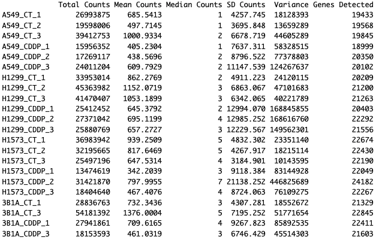
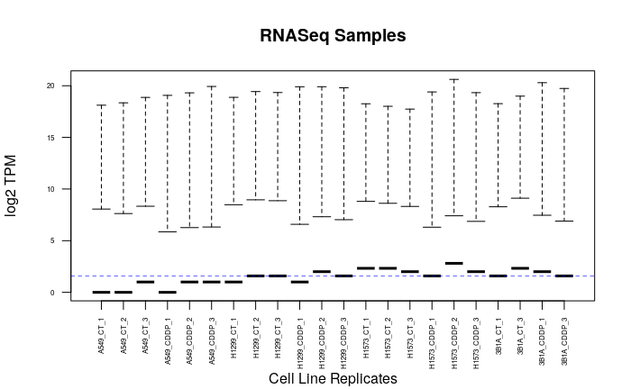
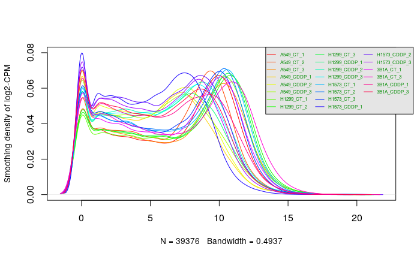
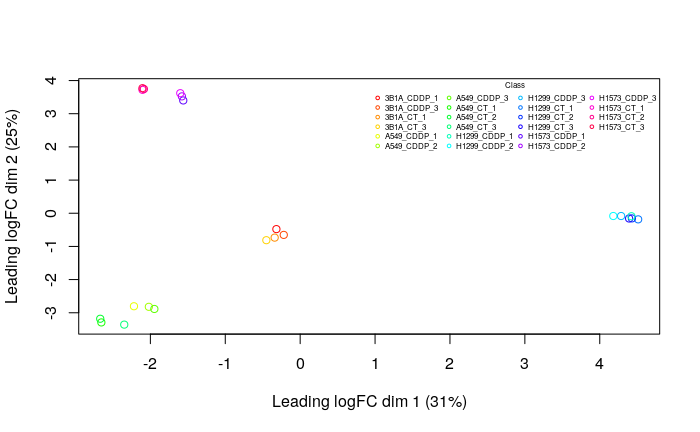
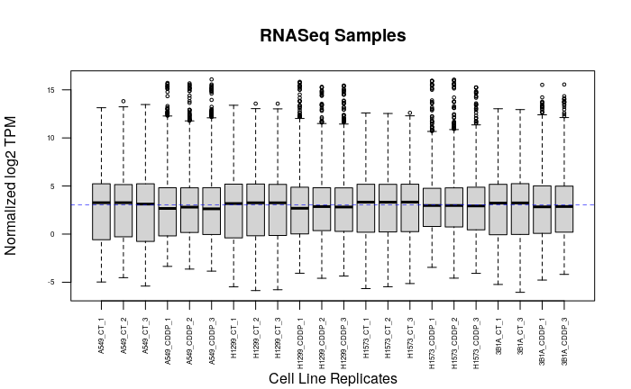
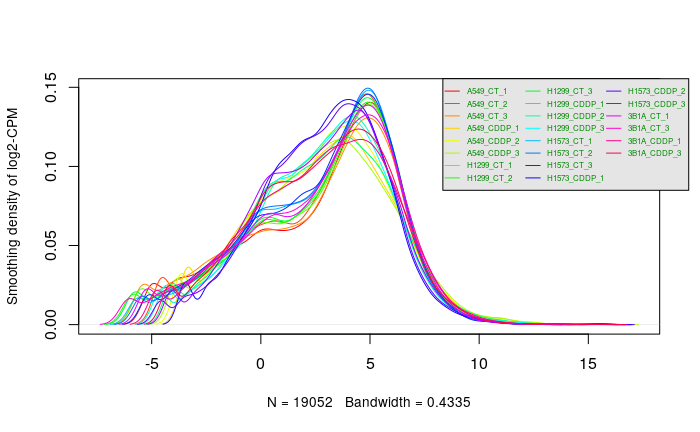
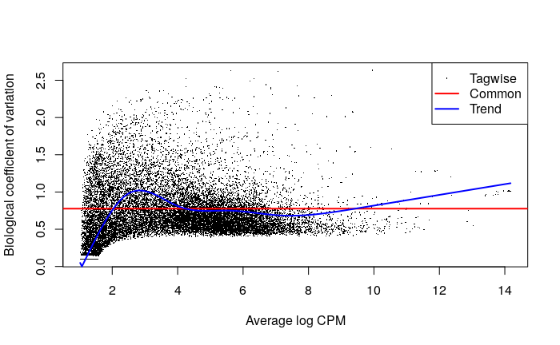

# 1. Background

## A. Study Summary

This project as well as the dataset utilized in it is based on the study titled `Molecular mechanisms associated with cis-platin intrinsic resistance in early drug-tolerant persister cells of lung adenocarcinoma cell lines`[@datasetSource].

Cisplatin resistance, primarily due to Drug-tolerant-persister (DTP) cells, is a major cause of treatment failure in lung adenocarcinoma. This study explores the initial response of DTP cells to Cisplatin and aims to identify gene expression signatures linked to their emergence in lung adenocarcinoma.

## B. The Data

In our previous work, we downloaded, cleaned up, filtered and normalized the dataset associated with this study. The dataset was consolidated from a GEO (Gene Expression Omnibus) series [GSE213102](https://www.ncbi.nlm.nih.gov/geo/query/acc.cgi?acc=GSE213102). This dataset is a raw counts output of an RNAseq experiment. The initial data was comprised of 39373 genes with 22 samples.

These samples consist of 4 cell lines which are A549, H1299, H1573 and 3B1A. Each of these cell lines had 3 control and 3 test replicates, with the exception being 3B1A which had only 2 controls and 2 test samples. The following is a summary of the data, including core statistics and information about the original data for each sample.

 

**Figure 1.** This is a summary of the data. The rows are the samples of the data and the columns are the core statistics.

The following is a visualization of the distribution of the original data before any processing. We have used a box plot and a density graph to adequately represent the data.

 

**Figure 2.** This is a visual representation of the data.

## C. Data Filtering

In order for us to ensure that our experiment was replicatable and to ensure it was smooth as possible, before we normalized the data we filtered it. This ensure that our data is at the highest standard and allows us to tackle any outliers as well as remove any discrepancies in our data.

The filtering process was made of 4 primary steps:

1.  Duplicate Removal: Remove any duplicate rows in our data
2.  Low CPM Expressions Filtering: First we filtered only the expressions that had a cpm greater than 1. Then we further filtered it so that expressions where genes where the sum of expressions across the samples was less 2 were removed.
3.  Standardize gene names with HUGO: We mapped the gene identifiers to HUGO Symbols.
4.  Outlier Handling

Following the thorough filtering process that we performed, the number of genes in our dataset that passed all the tresholds and standardization processes went from 39373 genes to 19052 genes, giving us a coverage of $34.385\%$.

## D. Normalization

In the final step of our process we normalized our data using the Trimmed Mean of M-values (TMM) method. The reason we used TMM is because corrects for situations where the presence of highly expressed genes in one sample can disproportionately affect the overall library size, leading to misleading comparisons across samples (@compNormsApps) Therefore, by trimming or ignoring the most extreme M-values (log-ratios of expression), TMM normalization minimizes the influence of outliers or genes with extreme expression differences (@RPubsNormStrats)

The following figures are visualization of the distirbution of normalized data. This visual represenation of our data shows the trends and the overall state of our data following normalization.

 

**Figure 3.** This is a visual representation of the Normalized data. Starting from the top left we have our Multidimension Scaling (MDS) plot, to the right of it we have our box plot. In the bottom left we have our density plot and to it's right we have our dispersion plot, with three dispersions tagwise, common and trended.

# 2. Introduction

In this assignment, we aim to rank genes based on differential expression from normalized data, and then perform thresholded over-representation analysis to uncover dominant biological themes. Our goal is to link significant gene expressions with functional biological insights.

We'll use differential expression analysis, identifying significantly expressed genes through stringent thresholds and multiple hypothesis testing corrections, like the Benjamini-Hochberg method. Visualizations such as MA or volcano plots and heatmaps will illustrate these patterns, aiding in our understanding of the data's biological relevance.

Following this, we'll conduct thresholded over-representation analysis to identify enriched biological pathways among significantly expressed genes, using up-to-date annotation data for accuracy.

Ultimately, this study seeks to interpret the differential gene expression in a meaningful biological context, comparing our findings with existing literature to contribute to the understanding of the biological mechanisms involved. This approach aims to bridge the gap between quantitative data and biological significance, providing insights into the functional implications of our findings.

# 3. Previous Data Processing

## A. Data Loading

```{r, warning=FALSE, message=FALSE, echo=FALSE, results='hide'}

# loading the counts dataset from GEO into a table
geo_url <- "https://www.ncbi.nlm.nih.gov/geo/download/?format=file&type=rnaseq_counts"
dataset_path <- paste(geo_url, "acc=GSE213102", "file=GSE213102_raw_counts_GRCh38.p13_NCBI.tsv.gz", sep="&");
counts_data <- as.matrix(data.table::fread(dataset_path, header=T, colClasses="integer"), rownames="GeneID")

# loading the gene annotations table
annotation_path <- paste(geo_url, "type=rnaseq_counts", "file=Human.GRCh38.p13.annot.tsv.gz", sep="&")
gene_annotations <- data.table::fread(annotation_path, header=T, quote="", stringsAsFactors=F, data.table=F)

# Defining the row names for the annotations table to be the geneID's
rownames(gene_annotations) <- gene_annotations$GeneID

# The column names for the counts data the first componenet of the name is the 
# cell line, the second is the type of experiment where CT is control and CDDP
# is treated with Cisplatin and the last component is the replicate number
colnames(counts_data) <- c('A549_CT_1', 'A549_CT_2', 'A549_CT_3', 'A549_CDDP_1', 'A549_CDDP_2', 'A549_CDDP_3', 'H1299_CT_1', 'H1299_CT_2', 'H1299_CT_3', 'H1299_CDDP_1', 'H1299_CDDP_2', 'H1299_CDDP_3', 'H1573_CT_1', 'H1573_CT_2', 'H1573_CT_3', 'H1573_CDDP_1', 'H1573_CDDP_2', 'H1573_CDDP_3', '3B1A_CT_1', '3B1A_CT_3', '3B1A_CDDP_1', '3B1A_CDDP_3')
```

## B. Filtering

### i.Duplicate Removal

```{r, warning=FALSE, message=FALSE, echo=FALSE}
# Find the duplicate row names
dup_rows <- rownames(as.data.frame(counts_data))[duplicated(rownames(as.data.frame(counts_data)))]

# Remove rows with duplicate names
counts_data_unique <- as.data.frame(counts_data)[!rownames(as.data.frame(counts_data)) %in% dup_rows, ]
```

### ii. Low CPM Expression Removal

```{r, warning=FALSE, message=FALSE, echo=FALSE}
library(edgeR)

# The knockdown value which represents the replicate number for the condition
# with the lowest number of replicates
kd_val = 2

# We use our dataset to calculate the CPM
dataset_cpm <- edgeR::cpm(counts_data)

# Identify the rows that pass our threshold 
pass_thold <- rowSums(dataset_cpm > 1) >= kd_val

# Create a new dataset of counts after expressions with low cpm are removed
filtered_counts <- counts_data[pass_thold,]

```

### HGNC Symbol Standardization

```{r, warning=FALSE, message=FALSE, echo=FALSE}
# Create a named vector for mapping gene numbers to gene symbols
gene_to_symbol <- gene_annotations$Symbol
names(gene_to_symbol) <- gene_annotations$GeneID

# Replace the row names in filtered_counts with the corresponding gene symbols
# 'match' function is used to find the index of the gene numbers in the named vector
rownames(filtered_counts) <- gene_to_symbol[match(rownames(filtered_counts), names(gene_to_symbol))]

# If there are gene numbers that don't have a corresponding symbol, they will be replaced with NA.
missing_symbols <- is.na(rownames(filtered_counts))
rownames(filtered_counts)[missing_symbols] <- names(missing_symbols)[missing_symbols]

filtered_counts_df <- as.data.frame(filtered_counts)
```

### iii. Sample Metadata

```{r, warning=FALSE, message=FALSE, echo=FALSE}
# Sample vector
samples <- colnames(filtered_counts_df)

# Function to split each sample and transform the data
transform_samples <- function(sample) {
  parts <- unlist(strsplit(sample, "_")) # Splitting by underscore and unlist to convert to vector
  cell_line <- parts[1]
  treatment <- ifelse(parts[2] == "CDDP", "Cisplatin", "Control") # Transforming treatment
  # Return a named vector
  return(c(title = sample, organism = "Homo sapiens", cell_line = cell_line, treatment = treatment))
}

# Applying the function to each sample
transformed_samples <- lapply(samples, transform_samples)

# Convert the list to a dataframe
sampleMetadata <- do.call(rbind, transformed_samples)

rownames(sampleMetadata) <- sampleMetadata[,1]

# To ensure the dataframe format is correct
sampleMetadata <- as.data.frame(sampleMetadata)
```

### iv. Normalization
Normalization is done using the Trimmed Mean of M method[@tmmNorm] 
```{r, warning=FALSE, message=FALSE, echo=FALSE}
# Store the HUGO gene Symbols
gene_symbols <- rownames(filtered_counts_df)

# Create a DGEList object
dge <- edgeR::DGEList(counts = filtered_counts_df, group = sampleMetadata$treatment)

# Calculate the normalization factors using the TMM
dge <- edgeR::calcNormFactors(dge, method = "TMM")

# Compute normalized counts
norm_counts <- edgeR::cpm(dge, log = FALSE)

```

# 4. Differential Gene Expression

## A. Factor Comparison

In this section we will be conducting the differential gene expression on our normalized data. Our experiments model is complicated in that we have 4 cell lines with 2 treatments and then 3 replicates per treatment per cell line. Previously we compared all the different samples to each other. The following is the MDS plot from limma[@limma], however, using the treatment instead of the cell line.

```{r, warning=FALSE, message=FALSE, echo=FALSE}
col_vector <- rainbow(2)

limma::plotMDS(dge, labels=NULL, pch = 1,
               col = col_vector[factor(sampleMetadata$treatment)])
legend("topright",
       legend=levels(factor(sampleMetadata$treatment)),
       pch=c(1), col= col_vector,title="Class",
       bty = 'n', cex = 0.75)
```

**Figure 5.** In this figure we can see the MDS plot comparing the treatment with Cisplatin to that of the control.

## B. Data Restriction

Therefore, to study the effect of treatment with Cisplatin vs control, we will be restricting our data using dplyr[@dplyr], to only one of the cell lines which in this case is the H1573 cell line. This is because based on **Figure 5.** we can see that it is the cell line with the greatest difference between the two, treatment types.

```{r, warning=FALSE, message=FALSE, echo=FALSE}
library(dplyr)

# We modify our counts to leave only the results for the
# H1573 cell line
H1573_counts <- filtered_counts_df %>% select(contains("H1573"))

# We modify the normalized counts to leave only the results for the
# H1573 cell line
H1573_norm_counts <- as.data.frame(norm_counts) %>% select(contains("H1573"))


```

We will then modify the samples metadata as well to include only the samples for the H1573 cell line

```{r, warning=FALSE, message=FALSE, echo=FALSE}
# Firstly we identify the samples that belong to the H1573 cell line
rows_with_H1357 <- grep("H1573", rownames(sampleMetadata))

# Then we restrict the sample metadata to be only these rows
sample_metadata_H1357 <- sampleMetadata[rows_with_H1357, ]

sample_metadata_H1357

```

We will also be creating a design matrix that focuses only on the treatment type. This will allow us to get much smoother results. 

```{r, warning=FALSE, message=FALSE, echo=FALSE}
# This is our model design matrix representing the samples that have undergone treatment vs control for the H1573 cell line
design_model_treatment <- model.matrix(~ sample_metadata_H1357$treatment )

design_model_treatment

```

## C. Analysis

### i. Model Creation and Fitting

When it comes to differential gene expression there are a few major packages that we can use, which are Limma, EdgeR and Dseq2. For this assignment we will be using the EdgeR package[@edgeR] That is because it was designed specifically for RNAseq data processing, which is what we want to do here.

```{r, warning=FALSE, message=FALSE, echo=FALSE}

# Creating the DGElist object to store the counts
dge_H1573 <- DGEList(counts=H1573_counts, group=sample_metadata_H1357$treatment)

# Then we will estimate the dispersion parameter for each gene.
# This measures the variability of gene expression counts around the mean that is not explained by the mean-variance relationship typical of count data.
dge_H1573 <- estimateDisp(dge_H1573, design_model_treatment)

# Lastly we will fit the model. We will be using the glmQLFit function. 
# This function fits a generalized linear model (GLM) for each gene using the quasi-likelihood method. 
# This is to account for the overdispersion usually present in count data.
fit_model <- glmQLFit(dge_H1573, design_model_treatment)
```

### ii. Quasi liklihood model Differential Expression

In this step we will be calculating the differential expression using the Quasi Likelihood model. We will be using the QLftest. The QLftest performs quasi-likelihood F-tests to assess whether the gene expression for a specific coefficient is significantly different from zero. We will be using the the kable package from knitr to display our results[]

```{r, warning=FALSE, message=FALSE, echo=FALSE}
# We perform differential expression using Quasi Likelihood model
qlf.treatment_vs_control <- edgeR::glmQLFTest(fit_model, coef='sample_metadata_H1357$treatmentControl')

# We present our output using the kable function from Knitr
knitr::kable(topTags(qlf.treatment_vs_control), type="html",row.names =TRUE)
```

Then we anlyze our results to see which are our top hits, as well as which ones pass our threshold.

```{r, warning=FALSE, message=FALSE, echo=FALSE}
# We obtain all of our results
qlf_H1573_output_hits <- topTags(qlf.treatment_vs_control,
                           sort.by = "PValue",
                           n = nrow(H1573_counts))

```

Then we check how many of our data pass the threshold of p-value \< 0.05

```{r, warning=FALSE, message=FALSE, echo=FALSE}
# Restrict the p-value threshold to 0.05
length(which(qlf_H1573_output_hits$table$PValue < 0.05))

```

We can see that this value is too large, given our original size of 19403. Therefore, it becomes imperative to further restrict our threshold. This is so we only show the values that are significantly differntially expressed.

```{r, warning=FALSE, message=FALSE, echo=FALSE}
# Restrict the p-value threshold to 0.00006
sig_pvalue_list <- which(qlf_H1573_output_hits$table$PValue < 0.00006)

length(sig_pvalue_list)

```

Therfore, using our threshold of 0.00006, we can see that we have 2799 genes that are significantly differntially expressed. The reason we used a threshold of 0.00006 as opposed to the standard 0.05, was because a large number of genes had passed the threshold of 0.05 which shows signs of them not being significantly differentially expressed. This gives us a more realistic value for our data.

Then in the next stage we correct our p-values using a multiple hypothesis correction method. The method that we are using is the False Discovery Rate (FDR). In differential gene expression analysis, where thousands of genes are tested simultaneously for significant differences in expression, there's a high chance of encountering false positives. This means some genes might appear to be significantly differentially expressed by chance alone because so many tests are being conducted. Therefore, to mitigate for this we are using the FDR[@fdr]

```{r, warning=FALSE, message=FALSE, echo=FALSE}
# Restrict the p-value threshold to 0.00001
sig_fdr_list <- which(qlf_H1573_output_hits$table$FDR < 0.00006)

length(sig_fdr_list)

```

As we can see from our results above that 168 of our original 2799 genes passed the correction.

### iii. Visualization

To visualize our differential gene expression experiment after correction, we will be using an MA plot[@limma]. The MA plot provides us with a crucial visual assessement. It allows us to visualize the magnitude and direction of Change, where points above the horizontal axis represent genes that are upregulated, while points below represent genes that are downregulated. It can also help us visualize the data quality and normalization, where the spread of points in the MA plot can indicate data quality, with well-normalized data generally showing a symmetrical distribution around the M=0 line, which signifies no change. Lastly, it can show us outliers as well, where genes that stand out far from the bulk of the data points can be easily spotted as potential outliers.

In the below plot we have chosen to highlight the top genes that are significantly up and down regulated.

A gene of interest for this experiment is the SOCS1 gene. This is because the creatores of this study found significant differential expression levels for cell lines treated with Cisplating versus the control.

```{r, warning=FALSE, message=FALSE, echo=FALSE}
# Plotting the MA plot with the Average log CPM in the x-axis and log-fold-change for the control vs the treatment
plotMD(qlf.treatment_vs_control, xlab="Average log CPM", ylab="log-fold-change (Control vs Treatment)", 
       main="MA plot", status=NULL, 
       p.value=0.00006)
abline(h = 0, col="green")

# Find the position of SOCS1 in the rownames
gene_name <- "SOCS1"
gene_position <- which(rownames(qlf.treatment_vs_control) == gene_name)


# Check if gene_name exists in the data
if (length(gene_position) > 0) {
  # Extract the logFC and logCPM for SOSC1
  gene_logFC <- qlf.treatment_vs_control$table$logFC[gene_position]
  gene_logCPM <- qlf.treatment_vs_control$table$logCPM[gene_position]
  
  # Highlight SOCS1 on the plot
  points(gene_logCPM, gene_logFC, col="orange", pch=19, cex=1.5)
  
  # A text label
  text(gene_logCPM, gene_logFC, labels=gene_name, pos=4, col="orange")
} else {
  message("Gene symbol 'SOCS1' not found in the dataset.")
}


```

**Figure 6.** The above is an MA plot of the differential gene expression data. The red points show genes that have been significantly up regulated and the blue points show genes that have been significantly down regulated.

To further visualize these top hits, we will be using a heatmap. This will also allows us to visualize the grouping or clustering of the conditions. We will be using the ComplexHeatMap[@compHeatMaps] and the Circlize[@circlize] packages to do so. 

```{r, warning=FALSE, message=FALSE, echo=FALSE}

library(ComplexHeatmap)
library(circlize)

# We get the genes names for all the genes with significant differential expression
sig_gene_names <- rownames(qlf_H1573_output_hits$table)[sig_fdr_list] 

# We then obtain the gene list from the normalized counts
sig_normalized_gene_names <- which(rownames(H1573_norm_counts) %in% sig_gene_names) 

#Then we get the heatmap matrix for H1573, using only the significant genes
heatmap_matrix_H1573 <- as.matrix(H1573_norm_counts[sig_normalized_gene_names,])

# We then scale the heatmap_matrix_H1573 matrix
heatmap_matrix_H1573_scaled <- t(scale(t(heatmap_matrix_H1573))) 

# Then we create the color scale. In our code we take into account whether our values start from 0, or if there are negative values as well
if(min(heatmap_matrix_H1573_scaled)  == 0){
  heat_mat_col <- circlize::colorRamp2(c(min(heatmap_matrix_H1573_scaled), 
                           max(heatmap_matrix_H1573_scaled)), 
                           c("white", "red"))
} else {
  heat_mat_col <- circlize::colorRamp2(c(min(heatmap_matrix_H1573_scaled), 
                           0, max(heatmap_matrix_H1573_scaled)),
                           c("blue", "white", "red"))
  
}

# We define the colors for the the treatment types for the annotations of our heatmap
treatment_types <- unique(sample_metadata_H1357$treatment)
treatment_types_color_scales <- rainbow(2)
names(treatment_types_color_scales) <- treatment_types

ha_pat <- ComplexHeatmap::HeatmapAnnotation(df=data.frame(
  treatment=sample_metadata_H1357$treatment))

heatmap_H1573_final <- ComplexHeatmap::Heatmap(heatmap_matrix_H1573_scaled, 
                                               top_annotation = ha_pat,
                                               cluster_rows = TRUE,cluster_columns = TRUE,
                                               show_row_names = FALSE, show_column_names = FALSE,
                                               show_row_dend = TRUE, show_column_dend = TRUE, 
                                               col=heat_mat_col, show_heatmap_legend = TRUE, 
                                               column_title = "H1573 Cisplatin vs Control Top Hits")

heatmap_H1573_final


```

**Figure 7.** This is a heatmap of the genes that have been significantly differentially expressed. The heatmap compares the samples for the H1573 cell lines according to wehter they were treated with Cisplatin or not. We can see that there is significant clustering

From the heatmap above we can see clearly that our conditions cluster together. This applies both when the genes are up regulated and when they are downregulated. We can clearly see that for all 6 replicates the genes cluster together based on the treatment type.

This is because Cisplatin seems to have a clear effect on these genes, therefore, in all replicates of the H1573 cell line when the cell line is treated with Cisplatin we can see a significant difference to that when it is not treated.

# 5. Thresholded over-representation analysis

## A. Create Thresholded Gene List

Before , we perform our gene set enrichment analysis, lets take a look once more at our top hits.

```{r, warning=FALSE, message=FALSE, echo=FALSE}

knitr::kable(topTags(qlf.treatment_vs_control), type="html")
```

We know from our previous analysis that there are 2799 genes that pass our p-value threshold of \< 0.00006. A value that we chose to ensure that only the very top differentially expressed genes are present. So to look into our data further lets see our up regulated and down regulated genes.

```{r}

# We select only the genes who pass our pvalue threshold and are up regulated
up_regulated_gene_list <- row.names(qlf_H1573_output_hits)[which(qlf_H1573_output_hits$table$PValue < 0.00006 & qlf_H1573_output_hits$table$logFC > 0)]

# The number of upregulated genes that are differentially expressed
length(up_regulated_gene_list)

# The head of the list of genes that are up egulated
head(up_regulated_gene_list)


```

We can see that we have 2483 upregulated genes, which is the majority of our differentially expressed genes.

```{r}

# We select only the genes who pass our pvalue threshold and are down regulated
down_regulated_gene_list <- row.names(qlf_H1573_output_hits)[which(qlf_H1573_output_hits$table$PValue < 0.00006 & qlf_H1573_output_hits$table$logFC < 0)]

# The number of downregulated genes that are differentially expressed
length(down_regulated_gene_list)

# The head of the list of genes that are downregulated
head(down_regulated_gene_list)

```

From our result above we can see that we have 316 downregulated genes, which is approximately 1/9 of our total differentially expressed genes. We also see that our values hold up where the combined upregulated and downregulated genes sum up to 2799, which is our initial number.

Now we will create our thresholded list of genes. We have already created the lists of upregulated and downregulated genes. We will save both the upregulated and the downregulated genes list to a txt file. For the remainder of our expression we will not be using the created files but instead use the gene lists created above. However, we are storing these gene lists for future reference. 

```{r}

# Firstly we will create our file for the upregulated genes
write.table(x=up_regulated_gene_list,
            file=file.path(getwd(),"convcisplatin_upregulated_genes.txt"),
            sep = "\t",row.names = FALSE,
            col.names = FALSE,quote = FALSE)

# Then we will create our file for the downregulated genes
write.table(x=down_regulated_gene_list,
            file=file.path(getwd(),"convcisplatin_downregulated_genes.txt"),
            sep = "\t",row.names = FALSE,
            col.names = FALSE,quote = FALSE)
```

## B. Gene Set Enrichement Analysis

### i. nalysis

We will be conducting gene set enrichment analysis using `G:Profiler`[@GProf]. Specifically we will be using the gprofiler2 R package[@gprof2]. The reason we chose `G:Profiler` is because it provides us with many advantages over other tools. Firstly, it has comprehensive and up to date databases, which ensures that any analysis is being done on the latest data, which helps gurantee more accurate results. Furtheremore, it uses robust statistical methods to correct for multiple testing issues. Another important factor is the visualization capabilities, that provide us with great insights about our results. Lastly, it's ability to process large amounts of data as well as the immense customization of analysis parameters that it provides, makes `G:Profiler` as ideal candidate for a tool to use for gene set enrichement analysis.

For our annotation data, we will be using the following three sources:

-   **Reactome**: There are several reasons that make Reactome an excellent annotation data choice. Firstly, it has a comprehensive coverage, where it provides detailed information on various biological pathways and processes, as well as being curated from the scientific literature by expert biologists in a species-specific manner, ensuring high-quality and reliable annotations. Moreover, It integrates various types of data, including pathways, reactions, molecular events, and cellular processes, offering a holistic view of biological functions and their interconnections[@reactome].

-   **Go biologoical process**: Being from Gene Ontology (GO),Go biologoical process provides a standardized vocabulary of gene and gene product attributes across species, facilitating consistent annotations and comparisons. Furthermore, GO has a hierarchical structure that allows for the analysis at different levels of specificity, from very general biological processes to very specific ones, enabling researchers to tailor their analysis to their specific needs. Lastly, it is very widely adopted in the biological community, making it a familiar and trusted source for gene annotation and analysis[@GOBP].

-   **Wiki pathways**: Of the many reasons to choose Wiki pathways, one that makes it very unique is that its community curated, as in hat it allows for community curation, meaning that researchers and experts from around the world contribute to and update its content, leading to a very dynamic and up-to-date resource. This also gives it the advantage of including a wide variety of pathways, not just those that are well-established but also emerging pathways that are currently being researched, providing a broad view of biological processes. Therefore, because of its community-driven nature, WikiPathways can quickly adapt to include new knowledge and pathways, making it an excellent resource[@WP].


```{r}
library(gprofiler2)

# Firstly we will query G:Profiler using our complete differentially expressed genelist
all_genes_gprof_query <- gprofiler2::gost(query = c(up_regulated_gene_list, down_regulated_gene_list), 
                significant = FALSE,
                exclude_iea = TRUE,
                organism = "hsapiens",
                correction_method = "fdr", 
                domain_scope = "annotated",
                user_threshold = 0.00006, 
                numeric_ns = "", sources = c("GO:BP", "REAC", "WP"))

# Then we will query G:Profiler using upregulated genelist
upreg_gprof_query <- gprofiler2::gost(query = up_regulated_gene_list, 
                significant = FALSE,
                exclude_iea = TRUE,
                organism = "hsapiens",
                correction_method = "fdr", 
                domain_scope = "annotated",
                user_threshold = 0.00006, 
                numeric_ns = "", sources = c("GO:BP", "REAC", "WP"))


# Lastly we will query G:Profiler using downregulated genelist
downreg_gprof_query <- gprofiler2::gost(query = down_regulated_gene_list, 
                significant = FALSE,
                exclude_iea = TRUE,
                organism = "hsapiens",
                correction_method = "fdr", 
                domain_scope = "annotated",
                user_threshold = 0.00006, 
                numeric_ns = "", sources = c("GO:BP", "REAC", "WP"))

# Here we get the number of the genesets for each type of gene list, combined, upregulated and downregulated. 
allreg_genesets_num <- nrow(all_genes_gprof_query$result)
upreg_genesets_num <- nrow(upreg_gprof_query$result)
downreg_genesets_num <- nrow(downreg_gprof_query$result)

```

For our gene set enrichment analysis experiment we will be limiting the term size for our genes to be between 5 and 250. The reason we will be limiting the term sizes for our genes is to ensure that we have the most optimum results. This is because having too small or too large genesets can negatively affect our results. In the case of having genesets that are too small, they may not provide enough information to detect a signal or pattern, making it difficult to achieve statistical significance. This can also lead to overestimation of the effect size due to a small sample of genes. On the other hand having a geneset that is too big might be too broad, encompassing diverse biological processes that dilute specific signals. They can also lead to lower sensitivity in detecting differential expression within the specific context of interest.[@geneSetTermSize]

```{r}
# We will be restricting the term size for all the genesets to be between 5 and 250 inclusive. 

filtered_all_genes_gprof_result <- all_genes_gprof_query$result[which(all_genes_gprof_query$result$term_size >= 5 & all_genes_gprof_query$result$term_size <= 250),]

# The number of genesets in the G:Profiler output of the combined genelist after term size restriction
(allreg_filtered_genesets_num <-  nrow(filtered_all_genes_gprof_result))

filtered_upreg_gprof_result <- upreg_gprof_query$result[which(upreg_gprof_query$result$term_size >= 5 & upreg_gprof_query$result$term_size <= 250),]

# The number of genesets in the G:Profiler output of the upregulated genes after term size restriction
(upreg_filtered_genesets_num <-nrow(filtered_upreg_gprof_result))


filtered_downreg_gprof_result <- downreg_gprof_query$result[which(downreg_gprof_query$result$term_size >= 5 & downreg_gprof_query$result$term_size <= 250),]

# The number of genesets in the G:Profiler output of the upregulated genes after term size restriction
(downreg_filtered_genesets_num <-  nrow(filtered_downreg_gprof_result))

# Lastly, we will replace the results dataframe from the original output of the gost function call with the filtered result dataframe for all the 3 gene expression analysis outputs. 
all_genes_gprof_query$result <- filtered_all_genes_gprof_result
upreg_gprof_query$result <- filtered_upreg_gprof_result
downreg_gprof_query$result <- filtered_downreg_gprof_result


```

Following our gene set enrichment analysis for the our three gene lists, the first being all the differentially expressed genes, the second being the upregulated genes and the third being the downregulated genes, we obtained the following number of genesets. 

- All genes list: `r allreg_genesets_num`
- Upregulated genes list: `r upreg_genesets_num`
- Downregulated genes list: `r downreg_genesets_num`

Following this we then filtered our genesets to keep only the genesets whose term size was between 5 and 250, to ensure that we have adequate and more relevant results. This is the number of genesets after restricting the term size. 

- All genes list: `r allreg_filtered_genesets_num`
- Upregulated genes list: `r upreg_filtered_genesets_num`
- Downregulated genes list: `r downreg_filtered_genesets_num`


### ii. Visualization

#### a. Manhattan Plots

To visualize our data we will first plot the output of the gene expression analysis for each of the three outputs of gene expression analysis. We will be using a manhatan plot to showcase the result of the G:Profiler output. The Manhattan plot format allows for the immediate visual identification of significantly enriched terms, depicted as "peaks" in the plot. This makes it straightforward to spot which gene sets are most relevant to the condition or phenotype being studied.

1. The combined gene list of both the upregulated and the downregulated genes

```{r}

# Create the G:Profiler Manhattan plot 
allreg_plot <- gprofiler2::gostplot(all_genes_gprof_query, capped = FALSE, interactive = FALSE)

# Add a title using ggtitle from ggplot
allreg_plot_with_title <- allreg_plot + ggplot2::ggtitle("Combined Gene Set Expression Analysis")

# Display the plot
allreg_plot_with_title

```

**Figure 8.**. This figures showcases the gene set expression analysis output for the complete list of differentially expressed genes. As we can see from the graph above that GO:BP has the largest number of genesets. However, both Reactome and WP, seem to have a large percentage of their genes being more highly expressed. 

2. The gene list for the upregulated genes
```{r}

# Create the G:Profiler Manhattan plot 
upreg_plot <- gprofiler2::gostplot(upreg_gprof_query, capped = FALSE, interactive = FALSE)

# Add a title using ggtitle from ggplot
upreg_plot_with_title <- upreg_plot + ggplot2::ggtitle("Up Regulated Gene Set Expression Analysis")

# Display the plot
upreg_plot_with_title
```

**Figure 9.**. This figures showcases the gene set expression analysis output for the up regulated list of differentially expressed genes. As we can see from the graph above that results are very similar to the combined gene list graph. This is because the majority of the expressed genes were upregulated. 

3. The gene list for the downregulated genes
```{r}
# Create the G:Profiler Manhattan plot 
downreg_plot <- gprofiler2::gostplot(downreg_gprof_query, capped = FALSE, interactive = FALSE)

# Add a title using ggtitle from ggplot
downreg_plot_with_title <- downreg_plot + ggplot2::ggtitle("Down Regulated Gene Set Expression Analysis")

# Display the plot
downreg_plot_with_title
```

**Figure 10.**. This figures showcases the gene set expression analysis output for the downregulated list of differentially expressed genes. Even though we can see from the graph above that GO:BP has the largest number of genesets, we can also see that almost none of them have levels of differential expression. If we compare this to Reactome we see what appears to be a majority of genesets that are highly expressed. 


#### b. Top Pathway Hits

In this section we will be displaying the top pathways hits for all the three gene lists as individual tables. We will then use these results to compare the outputs.

For each of the results of the gene expression analysis experiment, we will display the top 10 hits.


```{r}
library(dplyr)
library(knitr)

# Sort the dataframe by 'p_value' using base R's order() function
sorted_all_genes_gprof_query <- all_genes_gprof_query$result[order(all_genes_gprof_query$result$p_value), ]

# Select only the desired columns and take the top 10 results
top_10_results_all_genes_gprof_query <- sorted_all_genes_gprof_query[1:10, c("term_name", "p_value", "source")]

# Display the table using kable, adding a title and caption
top_hits_table_all_genes_gprof_query <- knitr::kable(top_10_results_all_genes_gprof_query, caption = "All Regulated Genes Top Pathway Hits")

print(top_hits_table_all_genes_gprof_query)


```

**Table 1.** This table demonstrates the top 10 pathway hits for the gene expression analysis experiment on all the highly differntially expressed genes. 

```{r}
# Sort the dataframe by 'p_value' using base R's order() function
sorted_upreg_gprof_query <- upreg_gprof_query$result[order(upreg_gprof_query$result$p_value), ]

# Select only the desired columns and take the top 10 results
top_10_results_upreg_gprof_query <- sorted_upreg_gprof_query[1:10, c("term_name", "p_value", "source")]

# Display the table using kable, adding a title and caption
top_hits_table_upreg_gprof_query <- knitr::kable(top_10_results_upreg_gprof_query, caption = "Up Regulated Genes Top Pathway Hits")

print(top_hits_table_upreg_gprof_query)


```

**Table 2.** This table demonstrates the top 10 pathway hits for the gene expression analysis experiment for the upregulated genes. 

```{r}
# Sort the dataframe by 'p_value' using base R's order() function
sorted_downreg_gprof_query <- downreg_gprof_query$result[order(downreg_gprof_query$result$p_value), ]

# Select only the desired columns and take the top 10 results
top_10_results_downreg_gprof_query <- sorted_downreg_gprof_query[1:10, c("term_name", "p_value", "source")]

# Display the table using kable, adding a title and caption
top_hits_table_downreg_gprof_query <- knitr::kable(top_10_results_downreg_gprof_query, caption = "Down Regulated Genes Top Pathway Hits")

print(top_hits_table_downreg_gprof_query)


```
**Table 3.** This table demonstrates the top 10 pathway hits for the gene expression analysis experiment for the downregulated genes. 


In the analysis above, as well as our results as seen in **Table 1.**, **Table 2.** and **Table 3.**, show the output of pathway enrichment analyses for three different gene sets: all regulated genes, up-regulated genes, and down-regulated genes. 

In the all regulated genes output the analysis combined both up- and down-regulated genes, providing a general overview of the pathways affected. Pathways such as "RAC1 GTPase cycle" and "response to transforming growth factor beta" appear significantly enriched, which implies these pathways are broadly influenced by the overall changes in gene expression.

The pathways enriched among up-regulated genes are those that are likely driven by an increase in gene activity. Here, we also see the "RAC1 GTPase cycle" and "transforming growth factor beta receptor signaling pathway" among others, suggesting these are specifically influenced by genes that are being up-regulated.

Conversely, the pathways enriched among down-regulated genes, such as "HDACs deacetylate histones" and "DNA methylation," indicate processes that are likely being suppressed or reduced due to the down-regulation of associated genes.

Comparing the top hits for the 3 gene lists, we see firstly that the results for the combined genes are identical to that of the upregulated gene pathways, with a very high p-value. This suggests that these pathways are crucial in the study's context, potentially upregulated to drive certain biological responses.

On the converse, we see that there is no overlap between the top hits of the downregulated gene pathways and the up regulated gene pathways, as well as their being no similarities between the downregulated gene pathways and the combined gene pathways. 


# 6. Interpretation

## A. Over-representation Results Comparison to Original Paper

The over-representation results from our gene enrichment analysis do not directly support the conclusions or mechanisms discussed in the original paper regarding specific pathways like oxidative phosphorylation, cytochrome P450-mediated detoxification, RNA metabolism, and proteasome activity being positively enriched. Similarly, while there is an indirect connection through gene expression and cell cycle regulation pathways in the downregulated genes, the direct pathways noted in the original study (especially TGF-β, which appears in our upregulated list) are not directly corroborated by our results.

However, the presence of TGF-β related pathways amongst our upregulated genes contradicts the original study's findings where TGF-β signaling was mentioned as negatively enriched. This discrepancy suggests differences in the transcriptomic profiles being analyzed or differences in the response of the cells under study conditions, which could lead to alternative interpretations or new insights into the cellular mechanisms at play.

The over-representation results from our gene enrichment analysis both support and contradict the conclusions or mechanisms discussed in the original paper. While there's a notable contradiction regarding TGF-β signaling, other findings, such as the downregulation of pathways that could indirectly affect cell cycle and apoptosis, are in line with the broader themes of altered cell proliferation and survival mechanisms in CDDP-DTP cells. This analysis underscores the complexity of biological systems and the importance of considering multiple layers of regulation and signaling in understanding drug resistance and cellular responses. Further investigations could explore these discrepancies and the dynamic nature of these pathways in cancer cells.


## B. Exploration of Literature Evidence Backing Results

Yes, I was able to find several papers that support the results that we see. In our results we saw that there were several genesets that were associated with the growth factor beta (TGF-β) which were among the most upregulated. This is inline with the many literatures that we found that showed a strong correlation between upregulation of TGF-β and resistance to DNA damaging agents used in cancer treatment[@TGFB_1 ; @TGFB_2]. Not only that but these papers have shown that the upregulation of TGF-β, was repeatedly observed in Non-small Cell Lung Cancer cell lines that were resistant to Cisplatin[@TGFB_3] This evidence shows that the abundance of genesets related to TGF-β regulation in the H1573 treated with Cisplatin is inline with behavior exhibited by Cisplatin resistant cells.

# 7. References


