# 1.Background

## A. Study Summary

This project as well as the dataset utilized in it is based on the study titled `Molecular mechanisms associated with cis-platin intrinsic resistance in early drug-tolerant persister cells of lung adenocarcinoma cell lines`[@datasetSource].

Cisplatin resistance, primarily due to Drug-tolerant-persister (DTP) cells, is a major cause of treatment failure in lung adenocarcinoma. This study explores the initial response of DTP cells to Cisplatin and aims to identify gene expression signatures linked to their emergence in lung adenocarcinoma.

## B. The Data

In our previous work, we downloaded, cleaned up, filtered and normalized the dataset associated with this study. The dataset was consolidated from a GEO (Gene Expression Omnibus) series [GSE213102](https://www.ncbi.nlm.nih.gov/geo/query/acc.cgi?acc=GSE213102). This dataset is a raw counts output of an RNAseq experiment. The initial data was comprised of 39373 genes with 22 samples.

These samples consist of 4 cell lines which are A549, H1299, H1573 and 3B1A. Each of these cell lines had 3 control and 3 test replicates, with the exception being 3B1A which had only 2 controls and 2 test samples. The following is a summary of the data, including core statistics and information about the original data for each sample.

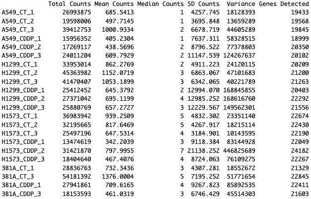

**Figure 1.** This is a summary of the data. The rows are the samples of the data and the columns are the core statistics.

The following is a visualization of the distribution of the original data before any processing. We have used a box plot and a density graph to adequately represent the data.

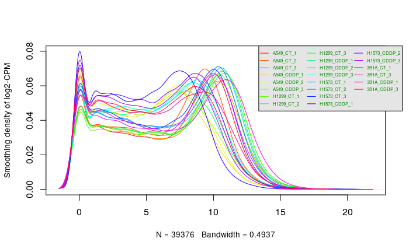

**Figure 2.** This is a visual representation of the data.

## C. Data Filtering

In order for us to ensure that our experiment was replicatable and to ensure it was smooth as possible, before we normalized the data we filtered it. This ensure that our data is at the highest standard and allows us to tackle any outliers as well as remove any discrepancies in our data.

The filtering process was made of 4 primary steps:

1.  Duplicate Removal: Remove any duplicate rows in our data
2.  Low CPM Expressions Filtering: First we filtered only the expressions that had a cpm greater than 1. Then we further filtered it so that expressions where genes where the sum of expressions across the samples was less 2 were removed.
3.  Standardize gene names with HUGO: We mapped the gene identifiers to HUGO Symbols.
4.  Outlier Handling

Following the thorough filtering process that we performed, the number of genes in our dataset that passed all the tresholds and standardization processes went from 39373 genes to 19052 genes, giving us a coverage of $34.385\%$.

## D. Normalization

In the final step of our process we normalized our data using the Trimmed Mean of M-values (TMM) method(@tmmNorm). The reason we used TMM is because corrects for situations where the presence of highly expressed genes in one sample can disproportionately affect the overall library size, leading to misleading comparisons across samples (@compNormsApps) Therefore, by trimming or ignoring the most extreme M-values (log-ratios of expression), TMM normalization minimizes the influence of outliers or genes with extreme expression differences (@RPubsNormStrats)

The following figures are visualization of the distirbution of normalized data. This visual represenation of our data shows the trends and the overall state of our data following normalization.

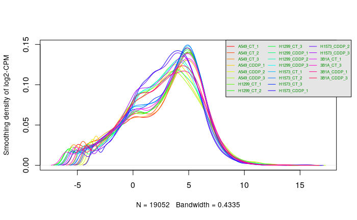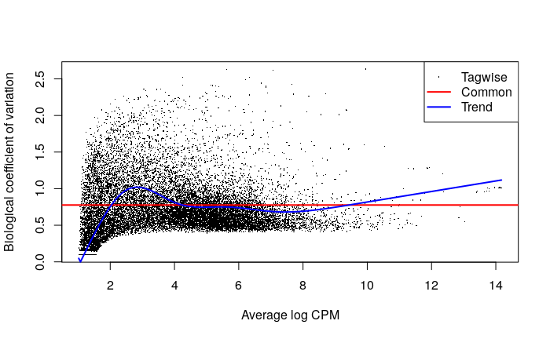

**Figure 3.** This is a visual representation of the Normalized data. Starting from the top left we have our Multidimension Scaling (MDS) plot, to the right of it we have our box plot. In the bottom left we have our density plot and to it's right we have our dispersion plot, with three dispersions tagwise, common and trended.

## E. Data Restriction

To study the effect of treatment with Cisplatin vs control, we restricted our data using dplyr[@dplyr], to only one of the cell lines which in this case was the H1573 cell line. This is because based on our MDS plot we saw that it is the cell line with the greatest difference between the two treatment types.

## F. Differential Gene Expression

### i. Model Fitting and Quasi liklihood model Differential Expression

For the differential gene expression we used the EdgeR[@edgeR] package. That is because it was designed specifically for RNAseq data processing, which is what we did. We firstly estimated the dispersion parameter for each gene. This measured the variability of gene expression counts around the mean that was not explained by the mean-variance relationship typical of count data. We then used the glmQLFit function to fit the model. This function fits a generalized linear model (GLM) for each gene using the quasi-likelihood method. This is to account for the overdispersion usually present in count data.

We then used the QLftest function to calculate the differential expression using the Quasi Likelihood model. The QLftest performs quasi-likelihood F-tests to assess whether the gene expression for a specific coefficient is significantly different from zero.

We then analyzed our output to see which were our top hits, as well as the genes that passed our threshold of \<0.05, which is the standard value. We saw that the value of 0.05 value was too large given our original size of 19403, as it would leave us with 12235 genes that are significantly differentially expressed. Therefore, it becomes imperative to further restrict our threshold. This is so we only show the values that are significantly differntially expressed. Therfore, using our threshold of 0.00006, we saw that we have 2799 genes that are significantly differntially expressed. Then in the next stage we corrected our p-values using a multiple hypothesis correction method. The method that we used was the False Discovery Rate (FDR). After the correction we were left with 168 of our original 2799 genes.

### ii. Visualization

To visualize our differential gene expression experiment after correction, we used an MA plot[@limma]. The MA plot allowed us to visualize the magnitude and direction of change, the data quality and normalization, as well as outliers as well, where genes that stand out far from the bulk of the data points can be easily spotted as potential outliers. Moreover, we chose to highlight the SOCS1 gene. This is because the creatores of this study found significant differential expression levels of SOCS1 for cell lines treated with Cisplatin versus the control.


**Figure 4.** The above is an MA plot of the differential gene expression data. The red points show genes that have been significantly up regulated and the blue points show genes that have been significantly down regulated.

To further visualize these top hits, we used the ComplexHeatMap[@compHeatMaps] and the Circlize[@circlize] packages to create a heatmap. This allowed us to visualize the grouping and clustering of the conditions.

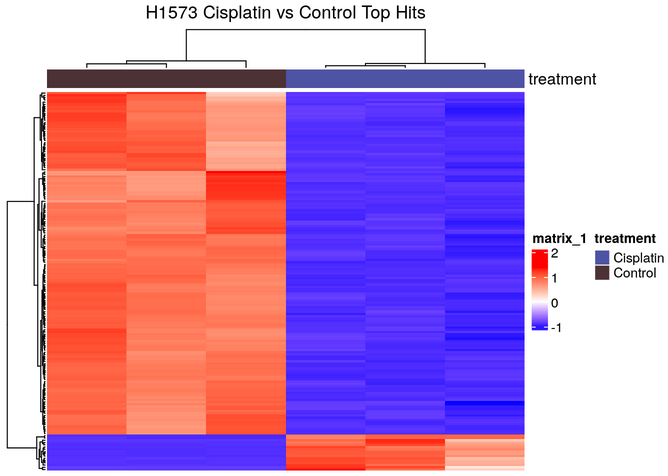

**Figure 5.** This is a heatmap of the genes that have been significantly differentially expressed. The heatmap compares the samples for the H1573 cell lines according to whether they were treated with Cisplatin or not. We can see that there is significant clustering.

From our graphs we were able to hypothesize that Cisplatin seemed to have a clear effect on these genes. This is because in all replicates of the H1573 cell line when the cell line was treated with Cisplatin we saw a significant difference to that when it is not treated.

## G. Thresholded over-representation Analysis

Finally we used \`\`G:Profiler (@GProf)to conduct thresholded over representation analysis. For our annotation data we used the following three sources:

-   **Reactome** (@reactome)
-   **Go biologoical process** (@GOBP)
-   **Wiki pathways** (@WP)

We then filtered our genesets to keep only the genesets whose term size was between 5 and 250 and passed the threshold, to ensure that we have adequate and more relevant results. This is the number of genesets after restricting the term size.

-   All genes list: 8362
-   Upregulated genes list: 8280
-   Downregulated genes list: 1307

To spot which gene sets are most relevant to the condition or phenotype being studied, we used a manhatan plot to showcase the result of the G:Profiler output.

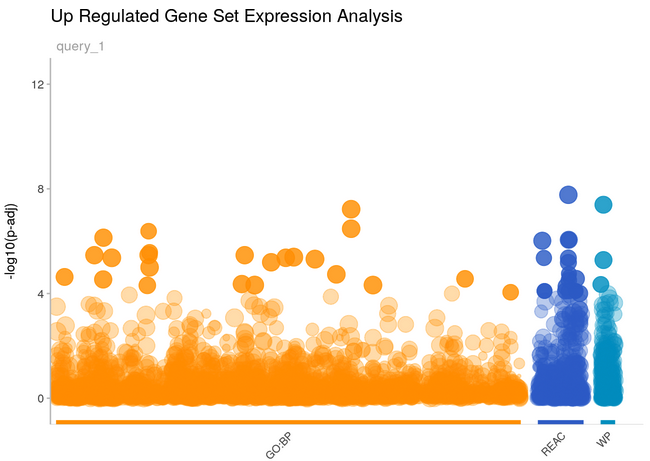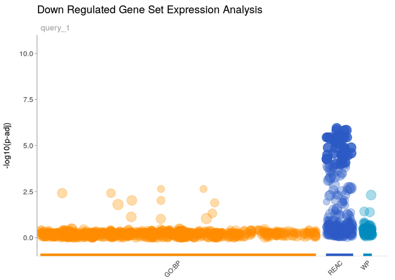

**Figure 6.** These figures showcases the gene set expression analysis output for the complete list of differentially expressed genes, the upregulated genes, and the downregulated genes respectively.

Following the completion of our analysis the following were the top pathway hits for each of the groups of genes. We can see that the combned and the upregulated top pathway hits are similarly, as the vast majority of the combined genes come from the upregulated list.

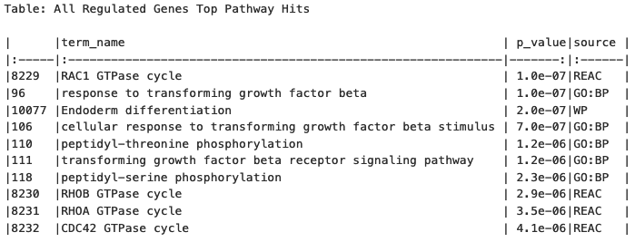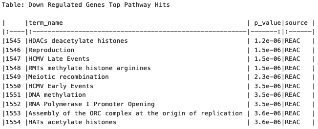

**Figure 6.** These tables above showcases the top 10 pathway hits for the gene expression analysis experiment for the complete list of differentially expressed genes, the upregulated genes, and the downregulated genes respectively.

# 2. Introduction

Our current study extends the groundwork laid in Assignments #1 and #2, where we performed normalization and scoring on genomic data obtained from the Gene Expression Omnibus (GEO) with the specific identifier X. This initial phase involved rigorous data preprocessing, normalization to minimize technical variability, and scoring to highlight genes of interest based on their differential expression levels. Basic statistical analyses provided a ranked list of genes, setting the stage for a more nuanced exploration of biological pathways involved.

Building upon this foundation, our objective in this assignment is to delve deeper into the biological implications of our ranked gene set through non-thresholded pathway analysis. Unlike thresholded methods that consider only genes surpassing a certain differential expression cutoff, non-thresholded analysis allows for the inclusion of all genes in the dataset, offering a comprehensive view of the potential biological pathways involved. This approach is pivotal for capturing subtle yet significant patterns that might be overlooked in thresholded analyses, providing a richer, more detailed map of gene interactions and functions.

To achieve this, we employ non-thresholded Gene Set Enrichment Analysis (GSEA), leveraging the ranked gene list from Assignment #2. This method enables us to identify which biological pathways are over-represented across our entire ranked gene set without arbitrary cutoffs, thus maintaining the integrity of the dataset's complexity. Our choice of gene sets, along with the specific versions and methodologies used, will be clearly outlined to ensure reproducibility and accuracy in our findings. This analysis not only enhances our understanding of the dataset but also allows for direct comparison with the thresholded analysis from Assignment #2, highlighting the nuances and additional insights gained through this approach.

Visualization of our results using Cytoscape and the Enrichment Map pipeline will further elucidate the complex network of gene interactions, providing a graphical representation that complements our statistical findings. By mapping the connections between enriched pathways, we aim to identify key nodes and clusters that signify biologically relevant pathways, offering insights into the underlying biological narrative. This step is crucial for translating our statistical findings into a coherent, visually intuitive format that can be easily interpreted and shared.

The culmination of this analysis is not just a comparative study of thresholded and non-thresholded methods but a comprehensive exploration into the biological significance of our dataset. Through detailed annotation, thematic network collapse, and rigorous interpretation of our findings in the context of existing literature, we aim to contribute meaningful insights. This endeavor not only underscores the importance of methodological rigor but also the transformative potential of bioinformatics in unraveling the complexities of biological systems.

# 3. Previous Data Processing

## A. Data Loading

```{r, warning=FALSE, message=FALSE, echo=FALSE, results='hide'}

# loading the counts dataset from GEO into a table
geo_url <- "https://www.ncbi.nlm.nih.gov/geo/download/?format=file&type=rnaseq_counts"
dataset_path <- paste(geo_url, "acc=GSE213102", "file=GSE213102_raw_counts_GRCh38.p13_NCBI.tsv.gz", sep="&");
counts_data <- as.matrix(data.table::fread(dataset_path, header=T, colClasses="integer"), rownames="GeneID")

# loading the gene annotations table
annotation_path <- paste(geo_url, "type=rnaseq_counts", "file=Human.GRCh38.p13.annot.tsv.gz", sep="&")
gene_annotations <- data.table::fread(annotation_path, header=T, quote="", stringsAsFactors=F, data.table=F)

# Defining the row names for the annotations table to be the geneID's
rownames(gene_annotations) <- gene_annotations$GeneID

# The column names for the counts data the first componenet of the name is the 
# cell line, the second is the type of experiment where CT is control and CDDP
# is treated with Cisplatin and the last component is the replicate number
colnames(counts_data) <- c('A549_CT_1', 'A549_CT_2', 'A549_CT_3', 'A549_CDDP_1', 'A549_CDDP_2', 'A549_CDDP_3', 'H1299_CT_1', 'H1299_CT_2', 'H1299_CT_3', 'H1299_CDDP_1', 'H1299_CDDP_2', 'H1299_CDDP_3', 'H1573_CT_1', 'H1573_CT_2', 'H1573_CT_3', 'H1573_CDDP_1', 'H1573_CDDP_2', 'H1573_CDDP_3', '3B1A_CT_1', '3B1A_CT_3', '3B1A_CDDP_1', '3B1A_CDDP_3')
```

## B. Filtering

### i.Duplicate Removal

```{r, warning=FALSE, message=FALSE, echo=FALSE}
# Find the duplicate row names
dup_rows <- rownames(as.data.frame(counts_data))[duplicated(rownames(as.data.frame(counts_data)))]

# Remove rows with duplicate names
counts_data_unique <- as.data.frame(counts_data)[!rownames(as.data.frame(counts_data)) %in% dup_rows, ]
```

### ii. Low CPM Expression Removal

```{r, warning=FALSE, message=FALSE, echo=FALSE}
library(edgeR)

# The knockdown value which represents the replicate number for the condition
# with the lowest number of replicates
kd_val = 2

# We use our dataset to calculate the CPM
dataset_cpm <- edgeR::cpm(counts_data)

# Identify the rows that pass our threshold 
pass_thold <- rowSums(dataset_cpm > 1) >= kd_val

# Create a new dataset of counts after expressions with low cpm are removed
filtered_counts <- counts_data[pass_thold,]

```

### HGNC Symbol Standardization

```{r, warning=FALSE, message=FALSE, echo=FALSE}
# Create a named vector for mapping gene numbers to gene symbols
gene_to_symbol <- gene_annotations$Symbol
names(gene_to_symbol) <- gene_annotations$GeneID

# Replace the row names in filtered_counts with the corresponding gene symbols
# 'match' function is used to find the index of the gene numbers in the named vector
rownames(filtered_counts) <- gene_to_symbol[match(rownames(filtered_counts), names(gene_to_symbol))]

# If there are gene numbers that don't have a corresponding symbol, they will be replaced with NA.
missing_symbols <- is.na(rownames(filtered_counts))
rownames(filtered_counts)[missing_symbols] <- names(missing_symbols)[missing_symbols]

filtered_counts_df <- as.data.frame(filtered_counts)
```

### iii. Sample Metadata

```{r, warning=FALSE, message=FALSE, echo=FALSE}
# Sample vector
samples <- colnames(filtered_counts_df)

# Function to split each sample and transform the data
transform_samples <- function(sample) {
  parts <- unlist(strsplit(sample, "_")) # Splitting by underscore and unlist to convert to vector
  cell_line <- parts[1]
  treatment <- ifelse(parts[2] == "CDDP", "Cisplatin", "Control") # Transforming treatment
  # Return a named vector
  return(c(title = sample, organism = "Homo sapiens", cell_line = cell_line, treatment = treatment))
}

# Applying the function to each sample
transformed_samples <- lapply(samples, transform_samples)

# Convert the list to a dataframe
sampleMetadata <- do.call(rbind, transformed_samples)

rownames(sampleMetadata) <- sampleMetadata[,1]

# To ensure the dataframe format is correct
sampleMetadata <- as.data.frame(sampleMetadata)
```

### iv. Normalization

Normalization is done using the Trimmed Mean of M method[@tmmNorm]

```{r, warning=FALSE, message=FALSE, echo=FALSE}
# Store the HUGO gene Symbols
gene_symbols <- rownames(filtered_counts_df)

# Create a DGEList object
dge <- edgeR::DGEList(counts = filtered_counts_df, group = sampleMetadata$treatment)

# Calculate the normalization factors using the TMM
dge <- edgeR::calcNormFactors(dge, method = "TMM")

# Compute normalized counts
norm_counts <- edgeR::cpm(dge, log = FALSE)

```

### v. Data Restriction

```{r, warning=FALSE, message=FALSE, echo=FALSE}
library(dplyr)

# We modify our counts to leave only the results for the
# H1573 cell line
H1573_counts <- filtered_counts_df %>% select(contains("H1573"))

# We modify the normalized counts to leave only the results for the
# H1573 cell line
H1573_norm_counts <- as.data.frame(norm_counts) %>% select(contains("H1573"))


```

```{r}

H1573_norm_counts_holder <- H1573_norm_counts

H1573_norm_counts_holder$Name <- row.names(H1573_norm_counts_holder)

write.table(H1573_norm_counts_holder, file="data/H1573_norm_counts.txt", sep=",", 
            row.names=FALSE, col.names=TRUE, quote=FALSE)

remove(H1573_norm_counts_holder)

```

```{r, warning=FALSE, message=FALSE, echo=FALSE}
# Firstly we identify the samples that belong to the H1573 cell line
rows_with_H1357 <- grep("H1573", rownames(sampleMetadata))

# Then we restrict the sample metadata to be only these rows
sample_metadata_H1357 <- sampleMetadata[rows_with_H1357, ]

```

```{r, warning=FALSE, message=FALSE, echo=FALSE}
# This is our model design matrix representing the samples that have undergone treatment vs control for the H1573 cell line
design_model_treatment <- model.matrix(~ sample_metadata_H1357$treatment )

```

## C. Differential Gene Expression

### i. Model Creation and Fitting

```{r, warning=FALSE, message=FALSE, echo=FALSE}

# Creating the DGElist object to store the counts
dge_H1573 <- DGEList(counts=H1573_counts, group=sample_metadata_H1357$treatment)

# Then we will estimate the dispersion parameter for each gene.
# This measures the variability of gene expression counts around the mean that is not explained by the mean-variance relationship typical of count data.
dge_H1573 <- estimateDisp(dge_H1573, design_model_treatment)

# Lastly we will fit the model. We will be using the glmQLFit function. 
# This function fits a generalized linear model (GLM) for each gene using the quasi-likelihood method. 
# This is to account for the overdispersion usually present in count data.
fit_model <- glmQLFit(dge_H1573, design_model_treatment)
```

### ii. Quasi liklihood model Differential Expression

```{r, warning=FALSE, message=FALSE, echo=FALSE}
# We perform differential expression using Quasi Likelihood model
qlf.treatment_vs_control <- edgeR::glmQLFTest(fit_model, coef='sample_metadata_H1357$treatmentControl')

```

```{r, warning=FALSE, message=FALSE, echo=FALSE}
# We obtain all of our results
qlf_H1573_output_hits <- topTags(qlf.treatment_vs_control,
                           sort.by = "PValue",
                           n = nrow(H1573_counts))


```

# 4. Non-Thresholded Gene Set Differential Expression

## A. Creating Gene Rank File H1573 Cell Line Cisplatin vs Control

```{r, warning=FALSE, message=FALSE}
# First, we calculate the ranking metric

qlf_H1573_output_hits$table$rank <- -log(qlf_H1573_output_hits$table$PValue, base = 10) * qlf_H1573_output_hits$table$logFC

# Then we create a new column for the gene names
qlf_H1573_output_hits$table$GeneName <- row.names(qlf_H1573_output_hits$table)

# Now we sort the dataframe by the new rank column
ranked_genes <- qlf_H1573_output_hits[order(-qlf_H1573_output_hits$table$rank),]

# We select only the GeneName and rank columns
final_ranked_genes <- ranked_genes[,c('GeneName', 'rank')]

# Check if the data directory exists, if not, create it
if (!dir.exists("data")) {
  dir.create("data")
}

# Write the output to a .rnk file in the data directory
write.table(final_ranked_genes, file="data/H1573_Cisplatin_vs_Control_RNASeq_ranks.rnk", sep="\t", 
            row.names=FALSE, col.names=TRUE, quote=FALSE)
```

This is the genes with the most positive rank, meaning the most up regulated genes.

```{r, warning=FALSE, message=FALSE, }
head(final_ranked_genes$table)
```

This is the genes with the most negative rank, meaning the most down regulated genes.

```{r, warning=FALSE, message=FALSE}
tail(final_ranked_genes$table)
```

## B. Performing Gene Differential Expression Analysis

For this experiment we will be using the GSEA software by (@GSEA1) and (@GSEA2). The GSEA software which is provided by the Broad Institute and UC San Diego, is considered a top-tier tool for Non-Thresholded Gene Set Differential Expression because it integrates a comprehensive and curated collection of gene sets and offers robust statistical frameworks. Unlike other methods that may rely on arbitrary cutoffs for gene selection, this version of GSEA utilizes the entire gene expression profile, preserving subtle yet meaningful biological variations within gene sets. The support of a rich database for gene set annotations further enhances the interpretability of the results, making it a great choice for this project as are aiming for depth and precision in understanding gene expression patterns and their impact on biological processes.

For this experiment we selected the Human gene sets from the Bader lab (@EnrichmentMap). The gene set that we will be using contains only genesets from GO biological process excluding annotations that have evidence code IEA (inferred from electronic annotation), ND (no biological data available), and RCA (inferred from reviewed computational analysis) and all pathway resources. Furthermore, this geneset is updated monthly, and comes with 3 different types of gene identifiers, Entrez gene ids, UniProt accessions, and HGNC gene symbols. Overall this gives us excellent source of gene sets, that is both regularly updated and is standardized to ensure the latest gene set information, and standards are met.

### i. Downloading the Gene Set and GSEA

Downloading the gene set from the Bader lab.

```{r, warning=FALSE, message=FALSE}
# Define the URL of the gene set file
geneset_url <- "http://download.baderlab.org/EM_Genesets/current_release/Human/symbol/Human_GOBP_AllPathways_noPFOCR_no_GO_iea_April_01_2024_symbol.gmt"

# Define the directory where the file will be saved
output_dir <- "processed_data"

# Create the directory if it does not exist
if (!dir.exists(output_dir)) {
  dir.create(output_dir)
}

# Define the path to the output file
output_file_path <- file.path(output_dir, "Human_GOBP_AllPathways_noPFOCR_no_GO_iea_April_01_2024_symbol.gmt")

# Download the file
download.file(geneset_url, destfile = output_file_path, method = "auto")

# Check if the download was successful
if (file.exists(output_file_path)) {
  message("The gene set file has been downloaded successfully.")
} else {
  stop("The gene set file could not be downloaded. Check the URL and try again.")
}

```

Downloading GSEA

```{r, warning=FALSE, message=FALSE}
# data_dir <- "data"
# gsea_dir_name <- "GSEA_4.3.3"
# gsea_dir <- file.path(data_dir, gsea_dir_name)
# 
# # Check if the GSEA_4.3.3 directory exists
# if (dir.exists(gsea_dir)) {
#   cat(sprintf("The directory '%s' already exists. No further action will be taken.", gsea_dir))
# } else {
#   print("reached")
#   # Define the URL to the ZIP file of the repository
#   GSEA_zip_url <- "https://github.com/bcb420-2024/Mogtaba_Alim/blob/bc5944754ab5827ee7f281381312af02a8fa1a80/Assignments/A3/data/GSEA_4.3.3.zip?raw=TRUE"
#   
#   zip_file_name <- "GSEA_433.zip"
#   
#   # Use download.file to fetch the ZIP file
#   download.file(GSEA_zip_url, zip_file_name, mode="wb")
#   
#   # Ensure the 'data' directory exists inside the current directory; create it if it doesn't
#   if (!dir.exists(data_dir)) {
#     dir.create(data_dir)
#   }
#   
#   
#   # Unzip the contents into the 'data' directory
#   unzip(zip_file_name, exdir = data_dir)
#   
#   # Delete the downloaded ZIP file
#   unlink(zip_file_name)
#   
#   # Print a confirmation message
#   cat("The ZIP file has been downloaded, extracted into '", data_dir, "', and the original ZIP file has been deleted.\n")
# 
# 
# }
# 
# chmod_command <- paste("chmod u+x", gsea_dir, "*.sh")
# 
# # Execute the command
# system(chmod_command)

```

### ii. Load Required Files

In this step we make sure that all the packages and R files required for our GSEA analysis are downloaded and exist.

```{r, warning=FALSE, message=FALSE}
#install required R and bioconductor packages
tryCatch(expr = { library("RCurl")}, 
         error = function(e) {  
           install.packages("RCurl")}, 
         finally = library("RCurl"))
```

### iii. Define Parameters

In this step we define all the parameters needed to run our GSEA. This includes the Jar file from which we will run the command line script, the gene set file, the ranked genes file, and finally other parameters required to run GSEA.

```{r, warning=FALSE, message=FALSE}

#path to GSEA jar 
gsea_jar <- "data/GSEA_4.3.3/gsea-cli.sh"

#directory where all the data files are found. 
working_dir <- "data"

#directory where all the data files are found.
output_dir <- "processed_data"

#The name to give the analysis in GSEA 
analysis_name <- "H1573_Cisplatin_vs_Control"

#rank file to use in GSEA analysis.  
rnk_file <- "H1573_Cisplatin_vs_Control_RNASeq_ranks.rnk"

# This parameter is to decide whether to run GSEA or not. THis is because if we have ran GSEA once we don't want to do it again everytime we compile the notebook. 
run_gsea <- TRUE

# The gene set file that we will be using
dest_gmt_file = file.path(output_dir, 
                          "Human_GOBP_AllPathways_noPFOCR_no_GO_iea_April_01_2024_symbol.gmt")


```

### iv. Run GSEA

In this final step, we will be running GSEA. Below you can see the function as well as our selected hyper parameters. The parameters of note include `nperm`, which is the number of permutations in which we shuffle the geneset. We also have `set_min` and `set_max`, which is minimum size of gene sets to include in our analysis. We chose a minimum size of 15, because gene sets that are too small may not provide enough information to detect a signal or pattern, making it difficult to achieve statistical significance. This can also lead to overestimation of the effect size due to a small sample of genes. We chose a maximum size of 200, because very large gene sets might be too broad, encompassing diverse biological processes that dilute specific signals. They can also lead to lower sensitivity in detecting differential expression within the specific context of interest.

```{r, warning=FALSE, message=FALSE}
if(run_gsea){
  command <- paste("",gsea_jar,  
                   "GSEAPreRanked -gmx", dest_gmt_file, 
                   "-rnk" ,file.path(working_dir,rnk_file), 
                   "-collapse false -nperm 1000 -scoring_scheme weighted", 
                   "-rpt_label ",analysis_name,
                   "  -plot_top_x 20 -rnd_seed 12345  -set_max 200",  
                   " -set_min 15 -zip_report false ",
                   " -out" ,output_dir, 
                   " > gsea_output.txt",sep=" ")
  system(command)
}
```

## C. Result Analysis and Vizualization

# 5. Visualization of Gene set Enrichment Analysis

To visualize the output of gene enrichment analysis we will be using Enrichment Map from Cytoscape (@Cytoscape).

Enrichment Map (@EnrichmentMap) is a powerful visualization tool provided by Cytoscape, designed specifically for the graphical representation of gene set enrichment results. This approach allows us to visually explore the relationships between gene sets, facilitating a deeper understanding of the biological pathways involved in their dataset. The core advantage of Enrichment Map lies in its ability to organize and display complex enrichment analysis outcomes in a network format, where nodes represent enriched gene sets and edges indicate shared genes between these sets, thus highlighting functional connections.

This method of visualization offers several benefits: it simplifies the interpretation of gene set enrichment analysis (GSEA) results, supports the identification of functionally related gene sets, and promotes the discovery of underlying biological themes within the data. By transforming the results of enrichment analyses into intuitive, visually-appealing networks, Enrichment Map enables us to more effectively communicate our results, especially when we come to compare multiple pathways and biological processes.

## A. Default Parameters

To start with, I first created my network using the default parameters. These parameters were as following:

-   **FDR q-value cutoff:** 0.1
-   **p-value cutoff:** 1.0
-   **NES** All
-   **Gene-set similarity filtering:**
    -   **Data Set Edges:** Automatic
    -   **Cutoff:** 0.375
    -   **Metric:** Jaccard+Overlap Combined (50%-50%)

This is the visualization of my network. 


**Figure 7.** The graph above showcases the enrchichment map network, using the default parameters that come with the application on Cytoscape. It is very clear that the output is not very meaningful in the context of our data. 

From the network graph seen in **Figure 7.**, we can see the enrichment map output for our differential expression analysis using the default parameters. From the network it is very clear that the default parameters do not provide us with a great enrichment map, and the output network is not very informative. Furthermore, it is clear that these default parameters are too broad, allowing for genesets, that are not significant to out experiment to be included as well. 

This can also be seen from the size of the network, where using the default parameters we got a network of 2072 nodes, meaning that many genesets, and 6321 edges. 

## B. Restricted Thresholds

In order for us to obtain more meanigful results and to be able to showcase only the genesets of most significance, we modified the default thresholds that were provided by Cytoscape. We kept the Gene-set similarity giltering section the same, to maintain consistency of the networks as well as the density of the network and we focused on the qualitative values which were the q-value and p-value. 

After many manipulations and iterations the number that we chose was the same maintained for the p-value, as it did not affect the graph very greatly, and instead focused on the q-value. In the end we chose a q-value of 0.005. This is because that is the value that we found to provide us with only the gene sets that significantly contributed, and it also matches our previous q-value definitions that provided us with significant results. We also used a sparser Edge Cutoff.  

These were our thresholds:

-   **FDR q-value cutoff:** 0.005
-   **p-value cutoff:** 1.0
-   **NES** All
-   **Gene-set similarity filtering:**
    -   **Data Set Edges:** Automatic
    -   **Cutoff:** 0.675
    -   **Metric:** Jaccard+Overlap Combined (50%-50%)

This was the output graph:

This is the visualization of my network. 
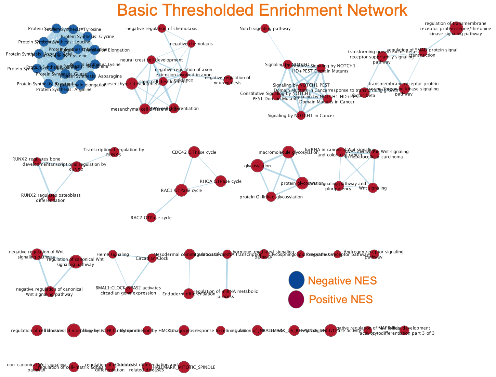

**Figure 8.** The graph above showcases the enrchichment map network, using the modified threshold parameters that we selected. It is very clear that the output is much more meaningful in the context of our data, compared to the default parameters, and provides a more detailed and significant mapping. 

This was a much better cut-off, and it provided us with a much more informative mapping. This left us with 85 total nodes, and 224 edges. 

Furthermore, we can see that following the threshold change, the demographic our enrichment map is changed. Firstly, our map now has significantly more gene sets with positive scores compared to negative scores. Furthermore, we see that the negatively scored gene sets all cluster together, while the positively scored gene sets form many separate groups. 


## C. Annotating Enrichment Network

When it come sto enrichment map networks, annoation serves as a critical step for making the visual data more interpretable and informative. By labeling clusters within the network with relevant biological terms or functional categories, annotation provides clarity on the biological processes or pathways that are represented by groups of interconnected gene sets. This enhances our understanding of the data by linking abstract network patterns to concrete biological concepts, allowing us to recognize functional themes and to easily communicate results. The added layer of information facilitates our identification of key biological mechanisms underlying the data, such as shared molecular functions, biological processes, or cellular components involved in the condition being studied.

The `AutoAnnotate` (@AutoAnnotate) package within Cytoscape automates this process by using advanced algorithms to detect clusters within the network and assign descriptive labels to them. It works by summarizing the network's structure and the enrichment results into concise, descriptive terms. This tool is particularly useful as it can help us process the networks efficiently, save time and reduce the potential errors compared to manual annotation.

AutoAnnotate not only streamlines the workflow but also allows us to customize the annotation process, giving us control over the visual aspects and the detail level of the annotations, thus tailoring the network to specific needs.

For this annotation we used AutoAnnotate's clusterMaker app. With it we chose the following parameters for annotation:

-   **Cluster Options:**
    -   **Cluster Alogrithm:** MCL CLuster
    -   **Edge Weight Column:** Similarity Coefficient
-   **Label Options:**
    -   **Label Column:** GS_DESCR
    -   **Label Algorithm:** WordCloud: Adjacent Words
    -   **Max Words per Label:** 3
    -   **Minimum Word Occurrence:** 1
    -   **Adjacent Bonus:** 8


This is out annotated map:


**Figure 8.** The graph above showcases the annotated enrichment map network. It is abundantly clear that the majority of clusters are of positvely scored gene sets. 

Following our annotation of our enrichment map, we see our output map in **Figure 8.**. This annotation provided us with some interesting insights. Firstly, our annotated map has 12 annotated clusters. Of the 12 only 1 of the clusters is of negatively scored gene sets, with the other 11 being positively scored gene sets. However, even though more of the clusters are of positively scored sets, we see that the negatively scored gene sets all cluster very close together meaning that most of the negatively scored gene sets have similar function, while the positively scored gene sets are more diverse int heir function. 

## C. Theme Network

In the next step we will be collapsing our enrichment map into a theme network. 

This process involves taking the individual gene sets within our enrichment network are consolidated into broader themes or categories that represent the underlying biological processes. This is often done by grouping together gene sets that share many genes in common or are functionally related, reducing the complexity of the network and making it easier to visualize and interpret the overall structure of the data.

The main reason for creating a theme network is to synthesize and streamline the results of a detailed enrichment analysis, distilling large amounts of data into a more digestible form. This helps us in identifying overarching biological themes or pathways that are enriched across different gene sets. By focusing on higher-level themes rather than individual gene sets, we can better understand the biological 'big picture' and how the different elements of the network relate to each other within this broader context.

Collapsing to a theme network can enhance our ability to detect major themes and patterns that align with the biological model being tested. It also allows us to quickly ascertain whether the observed enrichment supports the expected biological pathways and processes or if there are unexpected findings. By abstracting the data to this level, it becomes easier for us communicate findings to a wider audience, including those who may not be specialists in the field.

After collapsing our enrichment map into it's corresponding theme map. This our output:

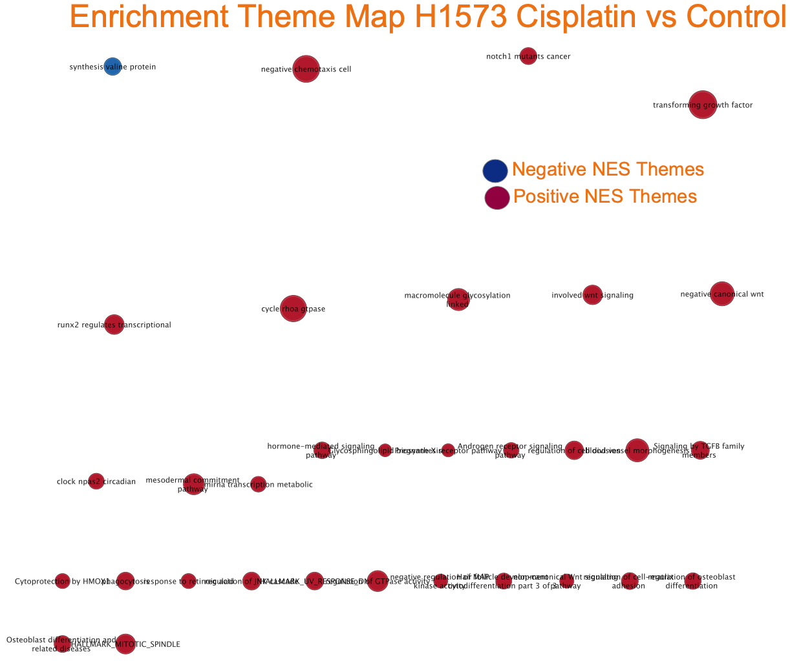

**Figure 9.** The graph above showcases the collapsed theme network of our enrichment map. It is is showing us the major themes and patterns that appear across our gene sets.


From our collapsed theme network seen in **Figure 9.**, we can see that we have some very prominent themes with many involved gene sets. For the negative gene sets we have only 1 theme called `synthesis valine protein` which is the exact thing as we saw in our annotated enrichment map. For the positive gene sets we had a few prominent themes, with the most prominent four being, `negative chemotaxis cell`, `transforming growth factor`, `cycle roha gtpase` and `negative canonical wnt`. From the outputs for our themes we can clearly see that they they fit our annotated model very well, where almost all the themes present are the exact name of the clusters we had in our annotated enrichment map. From our analysis we can see that most of the theme that are most enriched relate to cancer growth and development, which is what the focus of this study is. 


# 6. Result interpretation and Post-analysis

In this section we will be evaluating our results and analyzing them further. The point of this is for us to relate our results not only to the output of the Thresholded Over Representation Analysis that we did in assignment 2, but to also see if our results concur with the findings of the original publication. This will allow us to see if our initial study questions were meaningfully addressed and if so how and if not why. 

## A. Gene Set Expression Analyis Comparison to Orignal Paper and A2

In the original paper, the study reported transcriptional signature of early cisplatin drug-tolerant persister cells (DTPs) in lung adenocarcinoma. 

From our gene set expression analysis, it's clear that a vast array of protein synthesis pathways—specifically those for various amino acids were among the most negatively impacted. This suggests a general downregulation of protein synthesis mechanisms, possibly reflecting a response to cisplatin-induced stress, where the cell aims to conserve resources by limiting anabolic processes, which also could be evidence of another mechanisim of the effectiveness of Cisplatin, as increased amino acid metablosim is a large contributer to cance growth (@AminoAcidDeath). In contrast, the positive enrichment of pathways like "RUNX2 REGULATES BONE DEVELOPMENT" (@Runx2) and "NOTCH SIGNALING" (@notch) in our analysis indicates a level of cellular adaptation towards survival pathways, which might be a characteristic of DTP cells as they strive to circumvent the cytotoxic effects of the drug. These results can be seen as very clear evidence of the effect of Cisplatin on cell survivial, however, the evidence of cellular adaptation towards survival pathways could be an indication of potential attempts at resistance to Cisplatin seen in the cells. Furthermore, one the most highly negatively regulated gene sets, was the "SARCOMERE ORGANIZATION" pathway, which is inline with the expected behaviour of succesful chemotheraputic drugs(@chemotheraputic). Moreover, we saw novel pathways such as the "SENSORY PERCEPTION OF TASTE" pathway, which was not discussed in the original paper, however, we found it to be significantly negatively regulated. This was very in line with previous findings, where chemotherapeutic drugs have been found to have a significant effect on taste, with over 77% of patients in studies reporting this (@taste) .

The enrichment of NOTCH signaling and pathways related to the cell cycle in our positively regulated gene sets echoes the original paper's observations of DTP cells deregulating metabolic and proliferative pathways. The presence of "RUNX2 REGULATES OSTEOBLAST DIFFERENTIATION" also suggests a role in cell differentiation that may be relevant to DTP cell survival or the acquisition of a more resistant phenotype. Moreover, the "HALLMARK_UV_RESPONSE_DN" among negatively regulated sets could indicate a transcriptional response to DNA damage (@Hallmark), consistent with cisplatin's mode of action (@CisplatinAction).

 or known in the context of cisplatin response, they could represent new areas of interest. It's worth considering how alterations in these seemingly unrelated pathways could relate to cellular stress responses or metabolic changes in DTP cells.


```{r, warning=FALSE, message=FALSE}

```

```{r, warning=FALSE, message=FALSE}

```

```{r, warning=FALSE, message=FALSE}

```

## Including Plots

You can also embed plots, for example:

```{r pressure, echo=FALSE}
plot(pressure)
```

Note that the `echo = FALSE` parameter was added to the code chunk to prevent printing of the R code that generated the plot.
