---
title: "A2"
author: "Mogtaba Alim"
date: "2024-03-10"
output: 
  html_document:
    toc: true
    toc_depth: 2
bibliography: references.bib
---

# 1.Background

## A. Study Summary

This project as well as the dataset utilized in it is based on the study titled `Molecular mechanisms associated with cis-platin intrinsic resistance in early drug-tolerant persister cells of lung adenocarcinoma cell lines`[@datasetSource].

Cisplatin resistance, primarily due to Drug-tolerant-persister (DTP) cells, is a major cause of treatment failure in lung adenocarcinoma. This study explores the initial response of DTP cells to Cisplatin and aims to identify gene expression signatures linked to their emergence in lung adenocarcinoma.

## B. The Data

In our previous work, we downloaded, cleaned up, filtered and normalized the dataset associated with this study. The dataset was consolidated from a GEO (Gene Expression Omnibus) series [GSE213102](https://www.ncbi.nlm.nih.gov/geo/query/acc.cgi?acc=GSE213102). This dataset is a raw counts output of an RNAseq experiment. The initial data was comprised of 39373 genes with 22 samples.

These samples consist of 4 cell lines which are A549, H1299, H1573 and 3B1A. Each of these cell lines had 3 control and 3 test replicates, with the exception being 3B1A which had only 2 controls and 2 test samples. The following is a summary of the data, including core statistics and information about the original data for each sample.

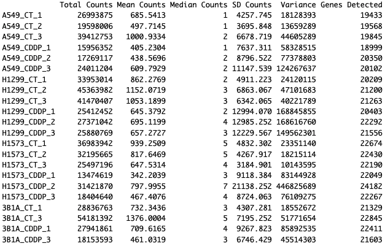

**Figure 1.** This is a summary of the data. The rows are the samples of the data and the columns are the core statistics.

The following is a visualization of the distribution of the original data before any processing. We have used a box plot and a density graph to adequately represent the data.

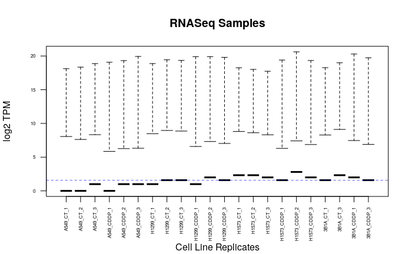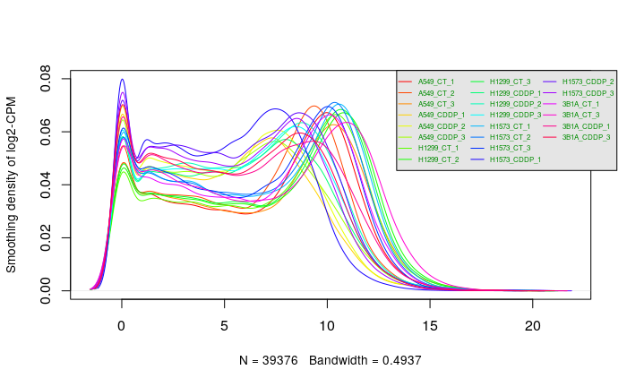

**Figure 2.** Comprehensive Visualization of RNA-Seq Data Across Cell Line Replicates. (A) Boxplot representation of the distribution of log2 TPM (Transcripts Per Million) values for RNA-Seq samples across multiple cell line replicates. Each boxplot corresponds to a separate cell line, indicating the median (central line), interquartile range (box limits), and potential outliers (individual points). The consistency across replicates can be assessed, with the dotted lines providing a visual guide for median TPM values across the different cell lines. (B) Smoothed density plots overlaying the distribution of log2 CPM (Counts Per Million) values across different cell lines and replicates. Each curve represents a distinct cell line and replicate combination, color-coded for identification, with the total number of observations (N) and the bandwidth used for smoothing indicated. These plots collectively facilitate the comparison of gene expression levels and variability within and between cell lines.

## C. Data Filtering

In order for us to ensure that our experiment was replicatable and to ensure it was smooth as possible, before we normalized the data we filtered it. This ensure that our data is at the highest standard and allows us to tackle any outliers as well as remove any discrepancies in our data.

The filtering process was made of 4 primary steps:

1.  Duplicate Removal: Remove any duplicate rows in our data
2.  Low CPM Expressions Filtering: First we filtered only the expressions that had a cpm greater than 1. Then we further filtered it so that expressions where genes where the sum of expressions across the samples was less 2 were removed.
3.  Standardize gene names with HUGO: We mapped the gene identifiers to HUGO Symbols.
4.  Outlier Handling

Following the thorough filtering process that we performed, the number of genes in our dataset that passed all the tresholds and standardization processes went from 39373 genes to 19052 genes, giving us a coverage of $34.385\%$.

## D. Normalization

In the final step of our process we normalized our data using the Trimmed Mean of M-values (TMM) method(@tmmNorm). The reason we used TMM is because corrects for situations where the presence of highly expressed genes in one sample can disproportionately affect the overall library size, leading to misleading comparisons across samples (@compNormsApps) Therefore, by trimming or ignoring the most extreme M-values (log-ratios of expression), TMM normalization minimizes the influence of outliers or genes with extreme expression differences (@RPubsNormStrats)

The following figures are visualization of the distirbution of normalized data. This visual represenation of our data shows the trends and the overall state of our data following normalization.

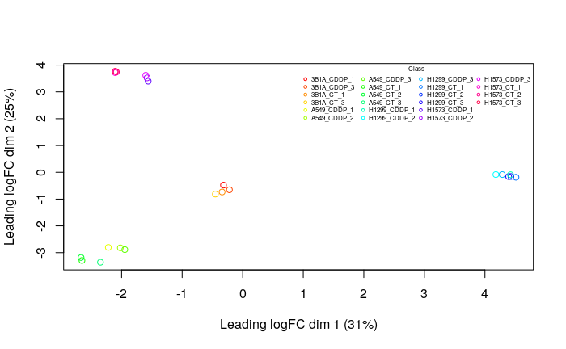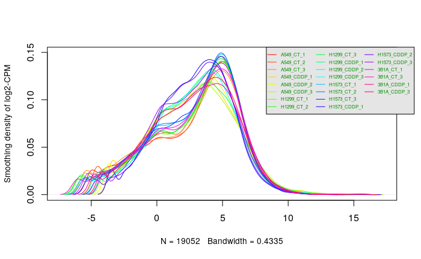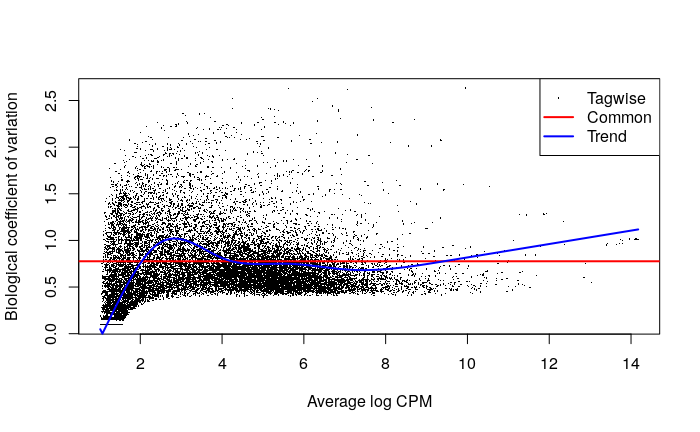

**Figure 3.** Multifaceted Analysis of Normalized Gene Expression Data. (A) Multidimensional scaling (MDS) plot displays the variation among RNA-Seq samples based on leading logFC (fold change) dimensions, capturing the most significant differences in expression data. Each point represents a sample, color-coded and labeled by group, illustrating the clustering pattern and dissimilarities between samples. The percentage of variance explained by each dimension is denoted on the axes. (B) Boxplot detailing the distribution of normalized log2 TPM values across cell line replicates post-normalization. Each box indicates the interquartile range of expression, with whiskers extending to the furthest data points within 1.5 times the interquartile range, and outliers represented as individual points. (C) Density plot overlaid with individual curves for each cell line replicate group, depicting the distribution of log2 CPM values, with the total number of observations and smoothing bandwidth indicated. (D) MA-plot (log-ratio vs. mean average plot) for quality control in RNA-Seq data analysis, where each point represents a gene. The plot contrasts log2 fold-changes (M-values) against the mean average expression values (A-values), with the common trend shown in red, the tagwise dispersion in black and the trend dispersion in red, highlighting genes that deviate from the expected normalization trend. This collection of graphs provides a comprehensive overview of the data's structure, emphasizing gene expression similarities and differences, as well as variability within and across cell lines.

## E. Data Restriction

To study the effect of treatment with Cisplatin vs control, we restricted our data using dplyr[@dplyr], to only one of the cell lines which in this case was the H1573 cell line. This is because based on our MDS plot we saw that it is the cell line with the greatest difference between the two treatment types.

## F. Differential Gene Expression

### i. Model Fitting and Quasi liklihood model Differential Expression

For the differential gene expression we used the EdgeR[@edgeR] package. That is because it was designed specifically for RNAseq data processing, which is what we did. We firstly estimated the dispersion parameter for each gene. This measured the variability of gene expression counts around the mean that was not explained by the mean-variance relationship typical of count data. We then used the glmQLFit function to fit the model. This function fits a generalized linear model (GLM) for each gene using the quasi-likelihood method. This is to account for the overdispersion usually present in count data.

We then used the QLftest function to calculate the differential expression using the Quasi Likelihood model. The QLftest performs quasi-likelihood F-tests to assess whether the gene expression for a specific coefficient is significantly different from zero.

We then analyzed our output to see which were our top hits, as well as the genes that passed our threshold of \<0.05, which is the standard value. We saw that the value of 0.05 value was too large given our original size of 19403, as it would leave us with 12235 genes that are significantly differentially expressed. Therefore, it becomes imperative to further restrict our threshold. This is so we only show the values that are significantly differntially expressed. Therfore, using our threshold of 0.00006, we saw that we have 2799 genes that are significantly differntially expressed. Then in the next stage we corrected our p-values using a multiple hypothesis correction method. The method that we used was the False Discovery Rate (FDR). After the correction we were left with 168 of our original 2799 genes.

### ii. Visualization

To visualize our differential gene expression experiment after correction, we used an MA plot[@limma]. The MA plot allowed us to visualize the magnitude and direction of change, the data quality and normalization, as well as outliers as well, where genes that stand out far from the bulk of the data points can be easily spotted as potential outliers. Moreover, we chose to highlight the SOCS1 gene. This is because the creatores of this study found significant differential expression levels of SOCS1 for cell lines treated with Cisplatin versus the control.

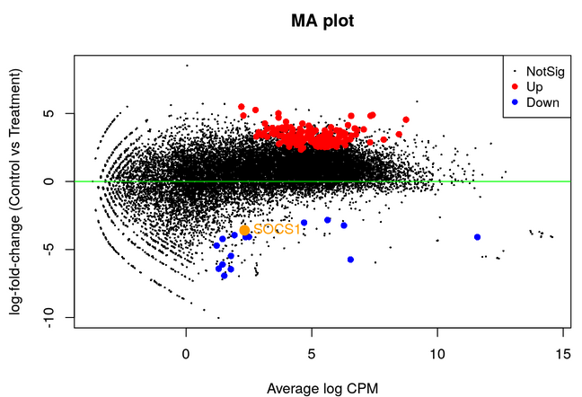

**Figure 4.** MA Plot Depicting Differential Expression Analysis. The plot visualizes log-fold changes (logFC) between control and treatment groups against the average log expression (Counts Per Million, CPM) for all detected genes. Each point represents a gene, with non-significant changes in black, upregulated genes in red, and downregulated genes in blue, providing a clear view of the differential expression landscape. Notably highlighted is the gene 'SOCS1' as an example of downregulation. The green line represents the threshold for zero fold change, serving as a reference for identifying genes with significant deviation from the baseline.

To further visualize these top hits, we used the ComplexHeatMap[@compHeatMaps] and the Circlize[@circlize] packages to create a heatmap. This allowed us to visualize the grouping and clustering of the conditions.

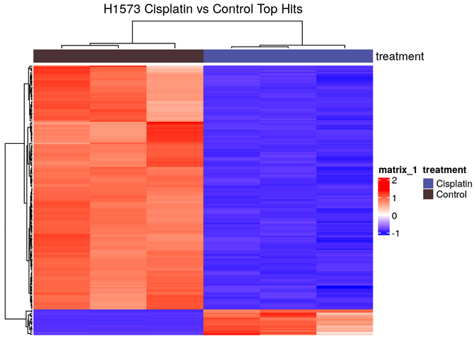

**Figure 5.** Heatmap of Top Differential Expression Hits for H1573 Cell Line Comparing Cisplatin Treatment with Control. This heatmap displays the expression levels of the most significantly altered genes post-treatment. Red indicates upregulated genes under Cisplatin treatment, while blue indicates downregulated genes, with intensity reflecting the degree of expression change. Rows represent individual genes, and columns represent treatment conditions as well as replicates of these conditions, demonstrating the clear separation between the effects of Cisplatin and control on gene expression profiles.  We can see that there is significant clustering.

From our graphs we were able to hypothesize that Cisplatin seemed to have a clear effect on these genes. This is because in all replicates of the H1573 cell line when the cell line was treated with Cisplatin we saw a significant difference to that when it is not treated.

## G. Thresholded over-representation Analysis

Finally we used \`\`G:Profiler (@GProf)to conduct thresholded over representation analysis. For our annotation data we used the following three sources:

-   **Reactome** (@reactome)
-   **Go biologoical process** (@GOBP)
-   **Wiki pathways** (@WP)

We then filtered our genesets to keep only the genesets whose term size was between 5 and 250 and passed the threshold, to ensure that we have adequate and more relevant results. This is the number of genesets after restricting the term size.

-   All genes list: 8362
-   Upregulated genes list: 8280
-   Downregulated genes list: 1307

To spot which gene sets are most relevant to the condition or phenotype being studied, we used a manhatan plot to showcase the result of the G:Profiler output.

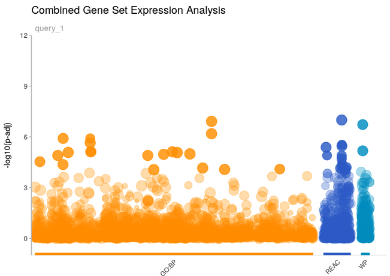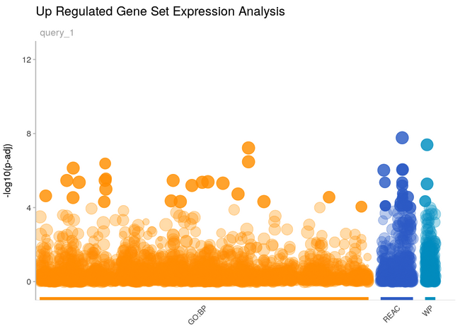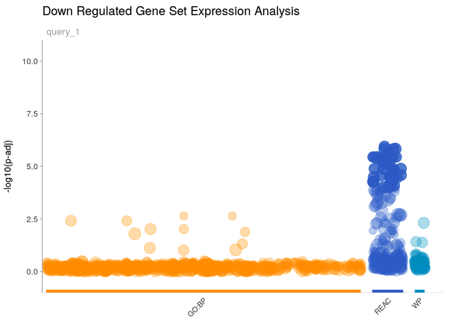

**Figure 6.** Visualization of G:Profiler Gene Set Expression Analysis Results with Manhattan Plots. This figure illustrates the gene sets most relevant to the studied condition or phenotype across three categories: combined, upregulated, and downregulated gene sets. (A) The Combined Gene Set Expression Analysis plot aggregates results from all sources, with gene sets plotted according to their -log10 p-value. The x-axis categorizes gene sets by their source databases: GO Biological Pathways (orange), Reactome (dark blue), and Wiki Pathways (light blue). (B) The Upregulated Gene Set Expression Analysis plot isolates gene sets with statistically significant expression increases, sorted by the same source color-coding, showcasing the gene sets most implicated in the upregulation observed in the phenotype of interest. (C) Conversely, the Downregulated Gene Set Expression Analysis plot filters for gene sets with significant expression decreases, again ordered by source. Each point represents a gene set, with its vertical position indicating the level of significance. 

Following the completion of our analysis the following were the top pathway hits for each of the groups of genes. We can see that the combned and the upregulated top pathway hits are similarly, as the vast majority of the combined genes come from the upregulated list.

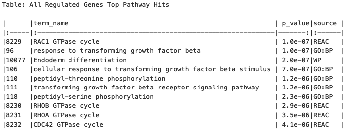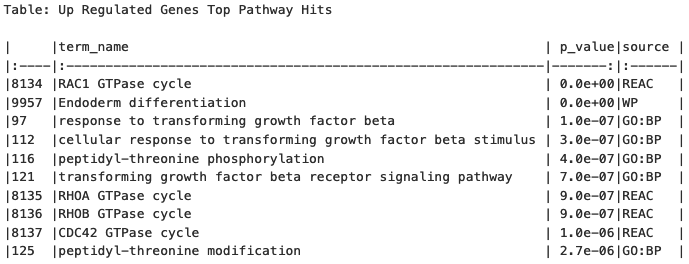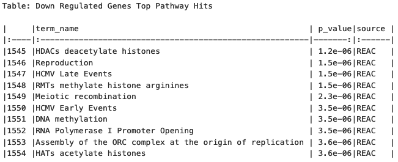

**Figure 7.** TDetailed Enrichment Analysis of Pathway Hits for Gene Regulation. The figure consists of three tables presenting the most significantly enriched pathways from the gene set enrichment analysis. Table 1: "All Regulated Genes Top Pathway Hits" displays the combined results for all regulated genes, including the name of the gene set, the p-value representing statistical significance, and the source database (REACT for Reactome, WP for Wiki Pathways, or GO_BP for Gene Ontology Biological Process). Table 2: "Up Regulated Genes Top Pathway Hits" focuses exclusively on pathways associated with upregulated genes, and Table 3: "Down Regulated Genes Top Pathway Hits" lists the top pathways corresponding to downregulated genes. Each table provides an ordered list based on the p-values, giving an immediate understanding of which pathways are most affected by the regulation—up or down—in the gene expression related to the studied condition or treatment. 

# 2. Introduction

Our current study extends the groundwork laid in Assignments #1 and #2, where we performed normalization and scoring on genomic data obtained from the Gene Expression Omnibus (GEO) with the specific identifier X. This initial phase involved rigorous data preprocessing, normalization to minimize technical variability, and scoring to highlight genes of interest based on their differential expression levels. Basic statistical analyses provided a ranked list of genes, setting the stage for a more nuanced exploration of biological pathways involved.

Building upon this foundation, our objective in this assignment is to delve deeper into the biological implications of our ranked gene set through non-thresholded pathway analysis. Unlike thresholded methods that consider only genes surpassing a certain differential expression cutoff, non-thresholded analysis allows for the inclusion of all genes in the dataset, offering a comprehensive view of the potential biological pathways involved. This approach is pivotal for capturing subtle yet significant patterns that might be overlooked in thresholded analyses, providing a richer, more detailed map of gene interactions and functions.

To achieve this, we employ non-thresholded Gene Set Enrichment Analysis (GSEA), leveraging the ranked gene list from Assignment #2. This method enables us to identify which biological pathways are over-represented across our entire ranked gene set without arbitrary cutoffs, thus maintaining the integrity of the dataset's complexity. Our choice of gene sets, along with the specific versions and methodologies used, will be clearly outlined to ensure reproducibility and accuracy in our findings. This analysis not only enhances our understanding of the dataset but also allows for direct comparison with the thresholded analysis from Assignment #2, highlighting the nuances and additional insights gained through this approach.

Visualization of our results using Cytoscape and the Enrichment Map pipeline will further elucidate the complex network of gene interactions, providing a graphical representation that complements our statistical findings. By mapping the connections between enriched pathways, we aim to identify key nodes and clusters that signify biologically relevant pathways, offering insights into the underlying biological narrative. This step is crucial for translating our statistical findings into a coherent, visually intuitive format that can be easily interpreted and shared.

The culmination of this analysis is not just a comparative study of thresholded and non-thresholded methods but a comprehensive exploration into the biological significance of our dataset. Through detailed annotation, thematic network collapse, and rigorous interpretation of our findings in the context of existing literature, we aim to contribute meaningful insights. This endeavor not only underscores the importance of methodological rigor but also the transformative potential of bioinformatics in unraveling the complexities of biological systems.

# 3. Previous Data Processing

## A. Data Loading

```{r, warning=FALSE, message=FALSE, echo=FALSE, results='hide'}

# loading the counts dataset from GEO into a table
geo_url <- "https://www.ncbi.nlm.nih.gov/geo/download/?format=file&type=rnaseq_counts"
dataset_path <- paste(geo_url, "acc=GSE213102", "file=GSE213102_raw_counts_GRCh38.p13_NCBI.tsv.gz", sep="&");
counts_data <- as.matrix(data.table::fread(dataset_path, header=T, colClasses="integer"), rownames="GeneID")

# loading the gene annotations table
annotation_path <- paste(geo_url, "type=rnaseq_counts", "file=Human.GRCh38.p13.annot.tsv.gz", sep="&")
gene_annotations <- data.table::fread(annotation_path, header=T, quote="", stringsAsFactors=F, data.table=F)

# Defining the row names for the annotations table to be the geneID's
rownames(gene_annotations) <- gene_annotations$GeneID

# The column names for the counts data the first componenet of the name is the 
# cell line, the second is the type of experiment where CT is control and CDDP
# is treated with Cisplatin and the last component is the replicate number
colnames(counts_data) <- c('A549_CT_1', 'A549_CT_2', 'A549_CT_3', 'A549_CDDP_1', 'A549_CDDP_2', 'A549_CDDP_3', 'H1299_CT_1', 'H1299_CT_2', 'H1299_CT_3', 'H1299_CDDP_1', 'H1299_CDDP_2', 'H1299_CDDP_3', 'H1573_CT_1', 'H1573_CT_2', 'H1573_CT_3', 'H1573_CDDP_1', 'H1573_CDDP_2', 'H1573_CDDP_3', '3B1A_CT_1', '3B1A_CT_3', '3B1A_CDDP_1', '3B1A_CDDP_3')
```

## B. Filtering

### i.Duplicate Removal

```{r, warning=FALSE, message=FALSE, echo=FALSE}
# Find the duplicate row names
dup_rows <- rownames(as.data.frame(counts_data))[duplicated(rownames(as.data.frame(counts_data)))]

# Remove rows with duplicate names
counts_data_unique <- as.data.frame(counts_data)[!rownames(as.data.frame(counts_data)) %in% dup_rows, ]
```

### ii. Low CPM Expression Removal

```{r, warning=FALSE, message=FALSE, echo=FALSE}
library(edgeR)

# The knockdown value which represents the replicate number for the condition
# with the lowest number of replicates
kd_val = 2

# We use our dataset to calculate the CPM
dataset_cpm <- edgeR::cpm(counts_data)

# Identify the rows that pass our threshold 
pass_thold <- rowSums(dataset_cpm > 1) >= kd_val

# Create a new dataset of counts after expressions with low cpm are removed
filtered_counts <- counts_data[pass_thold,]

```

### HGNC Symbol Standardization

```{r, warning=FALSE, message=FALSE, echo=FALSE}
# Create a named vector for mapping gene numbers to gene symbols
gene_to_symbol <- gene_annotations$Symbol
names(gene_to_symbol) <- gene_annotations$GeneID

# Replace the row names in filtered_counts with the corresponding gene symbols
# 'match' function is used to find the index of the gene numbers in the named vector
rownames(filtered_counts) <- gene_to_symbol[match(rownames(filtered_counts), names(gene_to_symbol))]

# If there are gene numbers that don't have a corresponding symbol, they will be replaced with NA.
missing_symbols <- is.na(rownames(filtered_counts))
rownames(filtered_counts)[missing_symbols] <- names(missing_symbols)[missing_symbols]

filtered_counts_df <- as.data.frame(filtered_counts)
```

### iii. Sample Metadata

```{r, warning=FALSE, message=FALSE, echo=FALSE}
# Sample vector
samples <- colnames(filtered_counts_df)

# Function to split each sample and transform the data
transform_samples <- function(sample) {
  parts <- unlist(strsplit(sample, "_")) # Splitting by underscore and unlist to convert to vector
  cell_line <- parts[1]
  treatment <- ifelse(parts[2] == "CDDP", "Cisplatin", "Control") # Transforming treatment
  # Return a named vector
  return(c(title = sample, organism = "Homo sapiens", cell_line = cell_line, treatment = treatment))
}

# Applying the function to each sample
transformed_samples <- lapply(samples, transform_samples)

# Convert the list to a dataframe
sampleMetadata <- do.call(rbind, transformed_samples)

rownames(sampleMetadata) <- sampleMetadata[,1]

# To ensure the dataframe format is correct
sampleMetadata <- as.data.frame(sampleMetadata)
```

### iv. Normalization

Normalization is done using the Trimmed Mean of M method[@tmmNorm]

```{r, warning=FALSE, message=FALSE, echo=FALSE}
# Store the HUGO gene Symbols
gene_symbols <- rownames(filtered_counts_df)

# Create a DGEList object
dge <- edgeR::DGEList(counts = filtered_counts_df, group = sampleMetadata$treatment)

# Calculate the normalization factors using the TMM
dge <- edgeR::calcNormFactors(dge, method = "TMM")

# Compute normalized counts
norm_counts <- edgeR::cpm(dge, log = FALSE)

```

### v. Data Restriction

```{r, warning=FALSE, message=FALSE, echo=FALSE}
library(dplyr)

# We modify our counts to leave only the results for the
# H1573 cell line
H1573_counts <- filtered_counts_df %>% select(contains("H1573"))

# We modify the normalized counts to leave only the results for the
# H1573 cell line
H1573_norm_counts <- as.data.frame(norm_counts) %>% select(contains("H1573"))


```

```{r}

H1573_norm_counts_holder <- H1573_norm_counts

H1573_norm_counts_holder <- cbind(Name = row.names(H1573_norm_counts_holder), H1573_norm_counts_holder)

write.table(H1573_norm_counts_holder, file="data/H1573_norm_counts.txt", sep=",", 
            row.names=FALSE, col.names=TRUE, quote=FALSE)

remove(H1573_norm_counts_holder)

```

```{r, warning=FALSE, message=FALSE, echo=FALSE}
# Firstly we identify the samples that belong to the H1573 cell line
rows_with_H1357 <- grep("H1573", rownames(sampleMetadata))

# Then we restrict the sample metadata to be only these rows
sample_metadata_H1357 <- sampleMetadata[rows_with_H1357, ]

```

```{r, warning=FALSE, message=FALSE, echo=FALSE}
# This is our model design matrix representing the samples that have undergone treatment vs control for the H1573 cell line
design_model_treatment <- model.matrix(~ sample_metadata_H1357$treatment )

```

## C. Differential Gene Expression

### i. Model Creation and Fitting

```{r, warning=FALSE, message=FALSE, echo=FALSE}

# Creating the DGElist object to store the counts
dge_H1573 <- DGEList(counts=H1573_counts, group=sample_metadata_H1357$treatment)

# Then we will estimate the dispersion parameter for each gene.
# This measures the variability of gene expression counts around the mean that is not explained by the mean-variance relationship typical of count data.
dge_H1573 <- estimateDisp(dge_H1573, design_model_treatment)

# Lastly we will fit the model. We will be using the glmQLFit function. 
# This function fits a generalized linear model (GLM) for each gene using the quasi-likelihood method. 
# This is to account for the overdispersion usually present in count data.
fit_model <- glmQLFit(dge_H1573, design_model_treatment)
```

### ii. Quasi liklihood model Differential Expression

```{r, warning=FALSE, message=FALSE, echo=FALSE}
# We perform differential expression using Quasi Likelihood model
qlf.treatment_vs_control <- edgeR::glmQLFTest(fit_model, coef='sample_metadata_H1357$treatmentControl')

```

```{r, warning=FALSE, message=FALSE, echo=FALSE}
# We obtain all of our results
qlf_H1573_output_hits <- topTags(qlf.treatment_vs_control,
                           sort.by = "PValue",
                           n = nrow(H1573_counts))


```

# 4. Non-Thresholded Gene Set Differential Expression

## A. Creating Gene Rank File H1573 Cell Line Cisplatin vs Control

```{r, warning=FALSE, message=FALSE}
# First, we calculate the ranking metric

qlf_H1573_output_hits$table$rank <- -log(qlf_H1573_output_hits$table$PValue, base = 10) * qlf_H1573_output_hits$table$logFC

# Then we create a new column for the gene names
qlf_H1573_output_hits$table$GeneName <- row.names(qlf_H1573_output_hits$table)

# Now we sort the dataframe by the new rank column
ranked_genes <- qlf_H1573_output_hits[order(-qlf_H1573_output_hits$table$rank),]

# We select only the GeneName and rank columns
final_ranked_genes <- ranked_genes[,c('GeneName', 'rank')]

# Check if the data directory exists, if not, create it
if (!dir.exists("data")) {
  dir.create("data")
}

# Write the output to a .rnk file in the data directory
write.table(final_ranked_genes, file="data/H1573_Cisplatin_vs_Control_RNASeq_ranks.rnk", sep="\t", 
            row.names=FALSE, col.names=TRUE, quote=FALSE)
```

This is the genes with the most positive rank, meaning the most up regulated genes.

```{r, warning=FALSE, message=FALSE, }
head(final_ranked_genes$table)
```

This is the genes with the most negative rank, meaning the most down regulated genes.

```{r, warning=FALSE, message=FALSE}
tail(final_ranked_genes$table)
```

## B. Performing Gene Differential Expression Analysis

For this experiment we will be using the GSEA software by (@GSEA1) and (@GSEA2). The GSEA software which is provided by the Broad Institute and UC San Diego, is considered a top-tier tool for Non-Thresholded Gene Set Differential Expression because it integrates a comprehensive and curated collection of gene sets and offers robust statistical frameworks. Unlike other methods that may rely on arbitrary cutoffs for gene selection, this version of GSEA utilizes the entire gene expression profile, preserving subtle yet meaningful biological variations within gene sets. The support of a rich database for gene set annotations further enhances the interpretability of the results, making it a great choice for this project as are aiming for depth and precision in understanding gene expression patterns and their impact on biological processes.

For this experiment we selected the Human gene sets from the Bader lab (@EnrichmentMap). The gene set that we will be using contains only genesets from GO biological process excluding annotations that have evidence code IEA (inferred from electronic annotation), ND (no biological data available), and RCA (inferred from reviewed computational analysis) and all pathway resources. Furthermore, this geneset is updated monthly, and comes with 3 different types of gene identifiers, Entrez gene ids, UniProt accessions, and HGNC gene symbols. Overall this gives us excellent source of gene sets, that is both regularly updated and is standardized to ensure the latest gene set information, and standards are met.

### i. Downloading the Gene Set and GSEA

Downloading the gene set from the Bader lab.

```{r, warning=FALSE, message=FALSE}
# Define the URL of the gene set file
geneset_url <- "http://download.baderlab.org/EM_Genesets/current_release/Human/symbol/Human_GOBP_AllPathways_noPFOCR_no_GO_iea_April_01_2024_symbol.gmt"

# Define the directory where the file will be saved
output_dir <- "processed_data"

# Create the directory if it does not exist
if (!dir.exists(output_dir)) {
  dir.create(output_dir)
}

# Define the path to the output file
output_file_path <- file.path(output_dir, "Human_GOBP_AllPathways_noPFOCR_no_GO_iea_April_01_2024_symbol.gmt")

# Download the file
download.file(geneset_url, destfile = output_file_path, method = "auto")

# Check if the download was successful
if (file.exists(output_file_path)) {
  message("The gene set file has been downloaded successfully.")
} else {
  stop("The gene set file could not be downloaded. Check the URL and try again.")
}

```

### ii. Load Required Files

In this step we make sure that all the packages and R files required for our GSEA analysis are downloaded and exist.

```{r, warning=FALSE, message=FALSE}
#install required R and bioconductor packages
tryCatch(expr = { library("RCurl")}, 
         error = function(e) {  
           install.packages("RCurl")}, 
         finally = library("RCurl"))
```

### iii. Define Parameters

In this step we define all the parameters needed to run our GSEA. This includes the Jar file from which we will run the command line script, the gene set file, the ranked genes file, and finally other parameters required to run GSEA.

```{r, warning=FALSE, message=FALSE}

#path to GSEA jar 
gsea_jar <- "data/GSEA_4.3.3/gsea-cli.sh"

#directory where all the data files are found. 
working_dir <- "data"

#directory where all the data files are found.
output_dir <- "processed_data"

#The name to give the analysis in GSEA 
analysis_name <- "H1573_Cisplatin_vs_Control"

#rank file to use in GSEA analysis.  
rnk_file <- "H1573_Cisplatin_vs_Control_RNASeq_ranks.rnk"

# This parameter is to decide whether to run GSEA or not. THis is because if we have ran GSEA once we don't want to do it again everytime we compile the notebook. 
run_gsea <- !file.exists(file.path(getwd(),"processed_data", list.files(path = file.path(getwd(),"processed_data"), pattern = "\\.GseaPreranked")[1]))

# The gene set file that we will be using
dest_gmt_file = file.path(output_dir, 
                          "Human_GOBP_AllPathways_noPFOCR_no_GO_iea_April_01_2024_symbol.gmt")


```

### iv. Run GSEA

In this final step, we will be running GSEA. Below you can see the function as well as our selected hyper parameters. The parameters of note include `nperm`, which is the number of permutations in which we shuffle the geneset. We also have `set_min` and `set_max`, which is minimum size of gene sets to include in our analysis. We chose a minimum size of 15, because gene sets that are too small may not provide enough information to detect a signal or pattern, making it difficult to achieve statistical significance. This can also lead to overestimation of the effect size due to a small sample of genes. We chose a maximum size of 200, because very large gene sets might be too broad, encompassing diverse biological processes that dilute specific signals. They can also lead to lower sensitivity in detecting differential expression within the specific context of interest.

```{r, warning=FALSE, message=FALSE}
if(run_gsea){
  tt <- capture.output(command <- paste("",gsea_jar,  
                   "GSEAPreRanked -gmx", dest_gmt_file, 
                   "-rnk" ,file.path(working_dir,rnk_file), 
                   "-collapse false -nperm 1000 -scoring_scheme weighted", 
                   "-rpt_label ",analysis_name,
                   "  -plot_top_x 20 -rnd_seed 12345  -set_max 200",  
                   " -set_min 15 -zip_report false ",
                   " -out" ,output_dir, 
                   " > gsea_output.txt",sep=" "))
  remove(tt)
  system(command)
}
```

## C. Result Analysis and Vizualization

In this section we will be summarizing the results of our enrichment and analyzing the significance of our findings.

### i. Negatively Enriched Gene Sets

Starting with the negatively enriched gene sets, we had 255 gene sets that were negatively enriched. Of these 255 gene sets we had 20 gene sets that were very significantly enriched and had a FDR q-value < 0.005. 


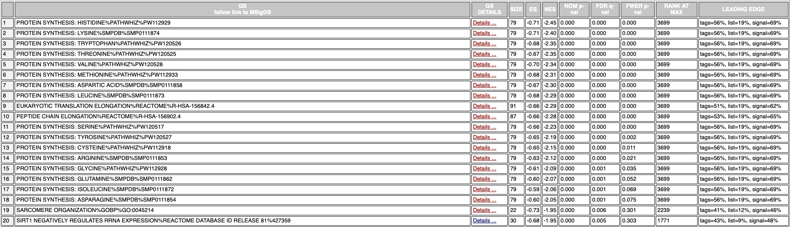

**Figure 8.** Gene Set Enrichment Analysis (GSEA) Results Highlighting Negatively Enriched Pathway's The table displays the top-ranking negatively enriched pathways from our GSEA, sorted by their normalized enrichment scores (NES). Each row details a distinct pathway, with its nomenclature followed by the source database, such as PATHWHIZ, SMPDB (Small Molecule Pathway Database), or Reactome. Columns from left to right include the pathway's GS (Gene Set) size, NES, nominal p-value (NOM p-val), false discovery rate q-value (FDR q-val), familywise error rate p-value (FWER p-val), and the rank at the gene set's maximum enrichment score (MAX). The 'Leading Edge' column lists the genes contributing most to the pathway's enrichment score. This visualization summarizes the direction and strength of association between gene sets and the experimental condition.

Looking at the results from **Figure 8.** we can see that the majority of the most significantly negatively enriched gene sets are related to protein synthesis. 

Now taking a look at our top most negatively enriched gene set, which is the `PROTEIN SYNTHESIS: HISTIDINE%PATHWHIZ%PW112929` gene set. This gene set is comprised of 79 genes, with 52 of the 79 genes being part of the core enrichment. These are the statistics associated with the gene set:

 * pvalue: 0.000
 * ES: -0.71165663
 * NES: -2.448867
 * FDR: 0.000
 
The top gene associate with this gene set was the `RACK1` gene. 

This is the enrichment plot for the `PROTEIN SYNTHESIS: HISTIDINE%PATHWHIZ%PW112929` gene set. 

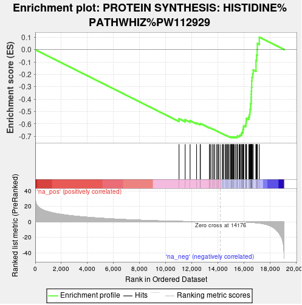

**Figure 9.** Enrichment Analysis for the "PROTEIN SYNTHESIS: HISTIDINE" Pathway. This enrichment plot visualizes the results of the gene set enrichment analysis, as identified by PATHWHIZ (PW112929). The green line represents the running enrichment score (ES) for the gene set, where the peak indicates the point of maximum enrichment. Genes are ranked along the x-axis according to their correlation with the phenotype, with the vertical black bars showing the position of genes in the histidine synthesis pathway within the ranked list. The bottom portion of the plot shows the ranking metric scores for individual genes, with the color gradient denoting the transition from genes positively correlated with the phenotype (red) to genes negatively correlated (blue). The point where the ES crosses zero is highlighted, indicating where the scores cease to be predominantly negative. This analysis pinpoints the specific locus of the histidine synthesis pathway's contribution.


### ii. Positively Enriched Gene Sets

Next, we look at the positively enriched gene sets. Unlike with our negatively enriched gene sets, the size of positively enriched gene sets is much greater, where we have 5529 positively enriched gene sets which is almost 22 times as many gene sets. Of these 5529 gene sets, we have a 83 which are very significantly enriched with an FDR q-value < 0.005, which is almost 4 times as many compared to the negatively enriched gene sets. 


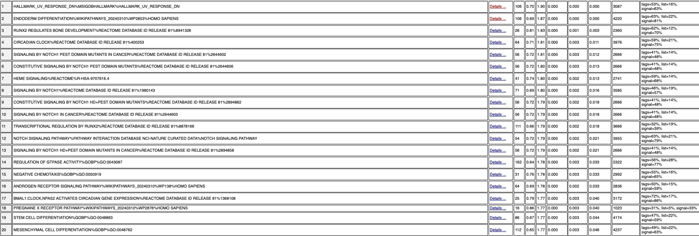

**Figure 10.** Gene Set Enrichment Analysis (GSEA) Results Highlighting Positively Enriched Pathway's The table displays the top-ranking positively enriched pathways from our GSEA, sorted by their normalized enrichment scores (NES). Each row details a distinct pathway, with its nomenclature followed by the source database, such as PATHWHIZ, SMPDB (Small Molecule Pathway Database), or Reactome. Columns from left to right include the pathway's GS (Gene Set) size, NES, nominal p-value (NOM p-val), false discovery rate q-value (FDR q-val), familywise error rate p-value (FWER p-val), and the rank at the gene set's maximum enrichment score (MAX). The 'Leading Edge' column lists the genes contributing most to the pathway's enrichment score. This visualization summarizes the direction and strength of association between gene sets and the experimental condition.

Looking at the results from **Figure 10.** we can see that the majority of the most significantly positively enriched gene sets are related to cell signaling. 

Now taking a look at our top most positively enriched gene set, which is the `HALLMARK_UV_RESPONSE_DN%MSIGDBHALLMARK%HALLMARK_UV_RESPONSE_DN` gene set. This gene set is comprised of 106 genes, with 56 of the 106 genes being part of the core enrichment. These are the statistics associated with the gene set:

 * pvalue: 0.000
 * ES: 0.6994422
 * NES: 1.9038458
 * FDR: 0.000
 
The top gene associate with this gene set was the `MYC` gene. 

This is the enrichment plot for the `HALLMARK_UV_RESPONSE_DN%MSIGDBHALLMARK%HALLMARK_UV_RESPONSE_DN` gene set. 

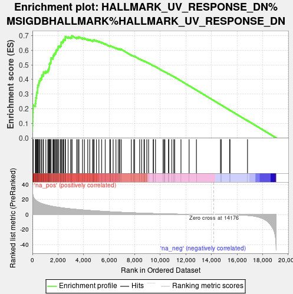

**Figure 11.** Gene Set Enrichment Plot for UV Response Downregulation. The plot displays the enrichment analysis of genes associated with the UV response, specifically those that are downregulated (HALLMARK_UV_RESPONSE_DN), according to the Molecular Signatures Database (MSigDB). The green line illustrates the enrichment score (ES) across the ranked list of genes, with a peak suggesting the point of highest collective downregulation within the gene set. Black vertical bars show the individual genes' positions, contributing to the enrichment score within the ranked dataset. The heatmap below the plot denotes the gene ranking based on their correlation with the UV response downregulation: genes positively correlated are shown in red, while negatively correlated genes are in blue. The enrichment plot's apex corresponds to the ranked position where the gene set shows maximum enrichment (leading-edge subset), whereas the zero crossing point indicates where the ES returns to the baseline, providing a clear demarcation of the gene set's boundary in the context of the dataset. This visualization elucidates the molecular footprint of UV response downregulation, serving as an insightful tool for understanding gene behavior under Cisplatin treatment.


### ii. Comparison to A2

In ORA, the pathways identified as downregulated involve processes like histone deacetylation, DNA methylation, and various stages of the cell cycle. The upregulated pathways in ORA point towards GTPase cycle regulation and cellular response to growth factors.

For GSEA, the pathways presented as downregulated encompass amino acid synthesis and eukaryotic translation elongation, which are fundamental to cellular growth and protein production. The upregulated pathways in GSEA indicate a response to UV response and signaling by NOTCH1 in cancer, which are involved in cellular stress response and signaling pathways associated with growth and differentiation.

Both analyses may share common themes around cell growth and response to external stimuli, but the specific pathways within these themes differ, which could be due to the differing natures of the analyses. In regards to sensitivity to changes, GSEA can detect pathways influenced by genes with moderate expression changes that may not meet the stringent threshold used in ORA. This could lead to GSEA highlighting more broad and systemic changes in the cellular environment.

When it comes to the Biological Insight, ORA might focus on pathways with significant gene expression changes, which might suggest a stronger biological effect. However, GSEA might highlight pathways where a coordinated change in gene expression occurs, even if the changes are not as strong, which could also be biologically meaningful. Therefore, direct comparison is not straightforward due to the methodological differences. ORA might miss biologically relevant pathways if not enough genes within a pathway cross the expression threshold, while GSEA can highlight pathways based on an aggregate change in expression, regardless of individual gene significance.

In conclusion, both ORA and GSEA offer valuable insights, but they present different views of the data. ORA provides a focused perspective on highly changed genes, while GSEA offers a broader view of gene expression trends across all genes. This distinction is crucial when interpreting the biological implications of the results, and often, a combined approach provides the most comprehensive understanding of the underlying biology.


# 5. Visualization of Gene set Enrichment Analysis

To visualize the output of gene enrichment analysis we will be using Enrichment Map from Cytoscape (@Cytoscape).

Enrichment Map (@EnrichmentMap) is a powerful visualization tool provided by Cytoscape, designed specifically for the graphical representation of gene set enrichment results. This approach allows us to visually explore the relationships between gene sets, facilitating a deeper understanding of the biological pathways involved in their dataset. The core advantage of Enrichment Map lies in its ability to organize and display complex enrichment analysis outcomes in a network format, where nodes represent enriched gene sets and edges indicate shared genes between these sets, thus highlighting functional connections.

This method of visualization offers several benefits: it simplifies the interpretation of gene set enrichment analysis (GSEA) results, supports the identification of functionally related gene sets, and promotes the discovery of underlying biological themes within the data. By transforming the results of enrichment analyses into intuitive, visually-appealing networks, Enrichment Map enables us to more effectively communicate our results, especially when we come to compare multiple pathways and biological processes.

## A. Default Parameters

To start with, I first created my network using the default parameters. These parameters were as following:

-   **FDR q-value cutoff:** 0.1
-   **p-value cutoff:** 1.0
-   **NES** All
-   **Gene-set similarity filtering:**
    -   **Data Set Edges:** Automatic
    -   **Cutoff:** 0.375
    -   **Metric:** Jaccard+Overlap Combined (50%-50%)

This is the visualization of my network. 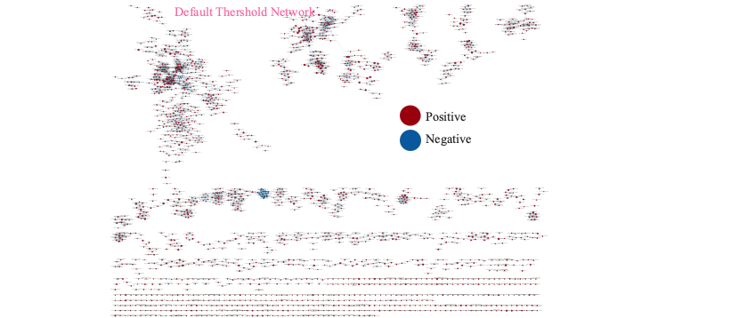

**Figure 12.** The graph above showcases the enrchichment map network, using the default parameters that come with the application on Cytoscape. The red nodes are the gene sets that are positively enriched and the blue nodes are the ones that are negatively enriched. It is very clear that the output is not very meaningful in the context of our data.

From the network graph seen in **Figure 12.**, we can see the enrichment map output for our differential expression analysis using the default parameters. From the network it is very clear that the default parameters do not provide us with a great enrichment map, and the output network is not very informative. Furthermore, it is clear that these default parameters are too broad, allowing for genesets, that are not significant to out experiment to be included as well.

This can also be seen from the size of the network, where using the default parameters we got a network of 2072 nodes, meaning that many genesets, and 6321 edges.

## B. Restricted Thresholds

In order for us to obtain more meanigful results and to be able to showcase only the genesets of most significance, we modified the default thresholds that were provided by Cytoscape. We kept the Gene-set similarity giltering section the same, to maintain consistency of the networks as well as the density of the network and we focused on the qualitative values which were the q-value and p-value.

After many manipulations and iterations the number that we chose was the same maintained for the p-value, as it did not affect the graph very greatly, and instead focused on the q-value. In the end we chose a q-value of 0.005. This is because that is the value that we found to provide us with only the gene sets that significantly contributed, and it also matches our previous q-value definitions that provided us with significant results. We also used a sparser Edge Cutoff.

These were our thresholds:

-   **FDR q-value cutoff:** 0.005
-   **p-value cutoff:** 1.0
-   **NES** All
-   **Gene-set similarity filtering:**
    -   **Data Set Edges:** Automatic
    -   **Cutoff:** 0.675
    -   **Metric:** Jaccard+Overlap Combined (50%-50%)

This was the output graph:

This is the visualization of my network. 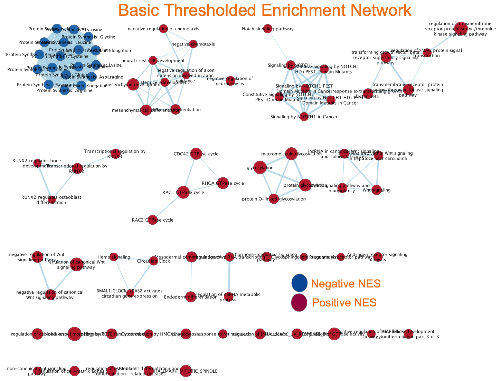

**Figure 13.** Enrichment Network from Gene Set Enrichment Analysis. The graph above showcases the enrchichment map network, using the modified threshold parameters that we selected. This network diagram represents the interconnectedness of various biological pathways based on gene set enrichment results. Nodes, depicted by circles, represent individual pathways with the size indicating the gene set's size, while the color denotes the Normalized Enrichment Score (NES); red for pathways positively correlated with the condition (positive NES), and blue for pathways negatively correlated (negative NES). Edges, the lines between nodes, indicate shared genes between pathways, illustrating the complex relationships and overlap between different biological processes.  The network provides a holistic view of the cellular functions most affected by the experimental conditions, allowing for the visualization of broad-scale patterns in the data such as pathway activation or suppression.  It is very clear that the output is much more meaningful in the context of our data, compared to the default parameters, and provides a more detailed and significant mapping.

This was a much better cut-off, and it provided us with a much more informative mapping. This left us with 85 total nodes, and 224 edges.

Furthermore, we can see that following the threshold change, the demographic our enrichment map is changed. Firstly, our map now has significantly more gene sets with positive scores compared to negative scores. Furthermore, we see that the negatively scored gene sets all cluster together, while the positively scored gene sets form many separate groups. Clusters of pathways suggest shared biological functions or coordinated regulation.

## C. Annotating Enrichment Network

When it come sto enrichment map networks, annoation serves as a critical step for making the visual data more interpretable and informative. By labeling clusters within the network with relevant biological terms or functional categories, annotation provides clarity on the biological processes or pathways that are represented by groups of interconnected gene sets. This enhances our understanding of the data by linking abstract network patterns to concrete biological concepts, allowing us to recognize functional themes and to easily communicate results. The added layer of information facilitates our identification of key biological mechanisms underlying the data, such as shared molecular functions, biological processes, or cellular components involved in the condition being studied.

The `AutoAnnotate` (@AutoAnnotate) package within Cytoscape automates this process by using advanced algorithms to detect clusters within the network and assign descriptive labels to them. It works by summarizing the network's structure and the enrichment results into concise, descriptive terms. This tool is particularly useful as it can help us process the networks efficiently, save time and reduce the potential errors compared to manual annotation.

AutoAnnotate not only streamlines the workflow but also allows us to customize the annotation process, giving us control over the visual aspects and the detail level of the annotations, thus tailoring the network to specific needs.

For this annotation we used AutoAnnotate's clusterMaker app. With it we chose the following parameters for annotation:

-   **Cluster Options:**
    -   **Cluster Alogrithm:** MCL CLuster
    -   **Edge Weight Column:** Similarity Coefficient
-   **Label Options:**
    -   **Label Column:** GS_DESCR
    -   **Label Algorithm:** WordCloud: Adjacent Words
    -   **Max Words per Label:** 3
    -   **Minimum Word Occurrence:** 1
    -   **Adjacent Bonus:** 8

This is out annotated map:

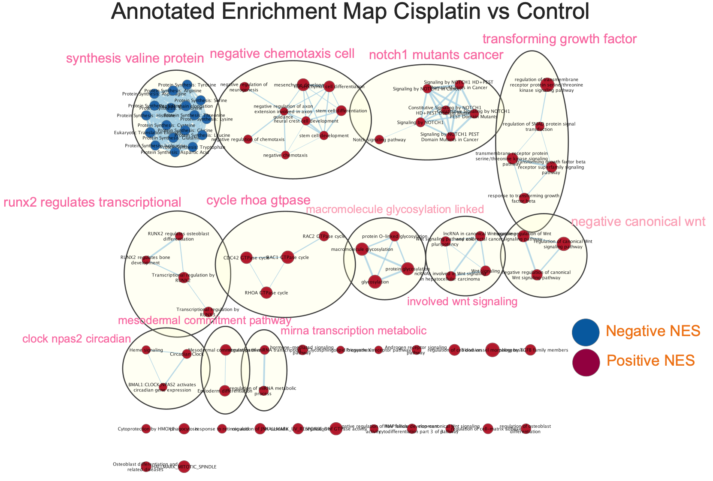

**Figure 14.** Annotated Enrichment Map for Cisplatin vs Control Analysis. This enrichment network graphically delineates the gene sets associated with the cellular response to Cisplatin treatment as opposed to control. Nodes represent individual gene sets, with their size proportional to the number of genes they contain, and their color reflecting the Normalized Enrichment Score (NES); blue for gene sets negatively correlated (Negative NES) and red for those positively correlated (Positive NES) with the treatment. Edges indicate shared genes between gene sets, suggesting functional and pathway overlaps. Larger labels highlight overarching biological themes such as "negative chemotaxis cell" and "involved wnt signaling", providing context to the complex web of pathway interactions influenced by Cisplatin. This visualization underscores the multifaceted nature of the drug's impact on cellular processes, with emphasis on pathways related to protein synthesis, cell cycle regulation, and signaling pathways mutated in cancer, offering insights into the broader implications of Cisplatin's effects on cellular function and gene regulation. It is also abundantly clear that the majority of clusters are of positvely scored gene sets.

Following our annotation of our enrichment map, we see our output map in **Figure 14.**. This annotation provided us with some interesting insights. Firstly, our annotated map has 12 annotated clusters. Of the 12 only 1 of the clusters is of negatively scored gene sets, with the other 11 being positively scored gene sets. However, even though more of the clusters are of positively scored sets, we see that the negatively scored gene sets all cluster very close together meaning that most of the negatively scored gene sets have similar function, while the positively scored gene sets are more diverse int heir function.

## C. Theme Network

In the next step we will be collapsing our enrichment map into a theme network.

This process involves taking the individual gene sets within our enrichment network are consolidated into broader themes or categories that represent the underlying biological processes. This is often done by grouping together gene sets that share many genes in common or are functionally related, reducing the complexity of the network and making it easier to visualize and interpret the overall structure of the data.

The main reason for creating a theme network is to synthesize and streamline the results of a detailed enrichment analysis, distilling large amounts of data into a more digestible form. This helps us in identifying overarching biological themes or pathways that are enriched across different gene sets. By focusing on higher-level themes rather than individual gene sets, we can better understand the biological 'big picture' and how the different elements of the network relate to each other within this broader context.

Collapsing to a theme network can enhance our ability to detect major themes and patterns that align with the biological model being tested. It also allows us to quickly ascertain whether the observed enrichment supports the expected biological pathways and processes or if there are unexpected findings. By abstracting the data to this level, it becomes easier for us communicate findings to a wider audience, including those who may not be specialists in the field.

After collapsing our enrichment map into it's corresponding theme map. This our output:

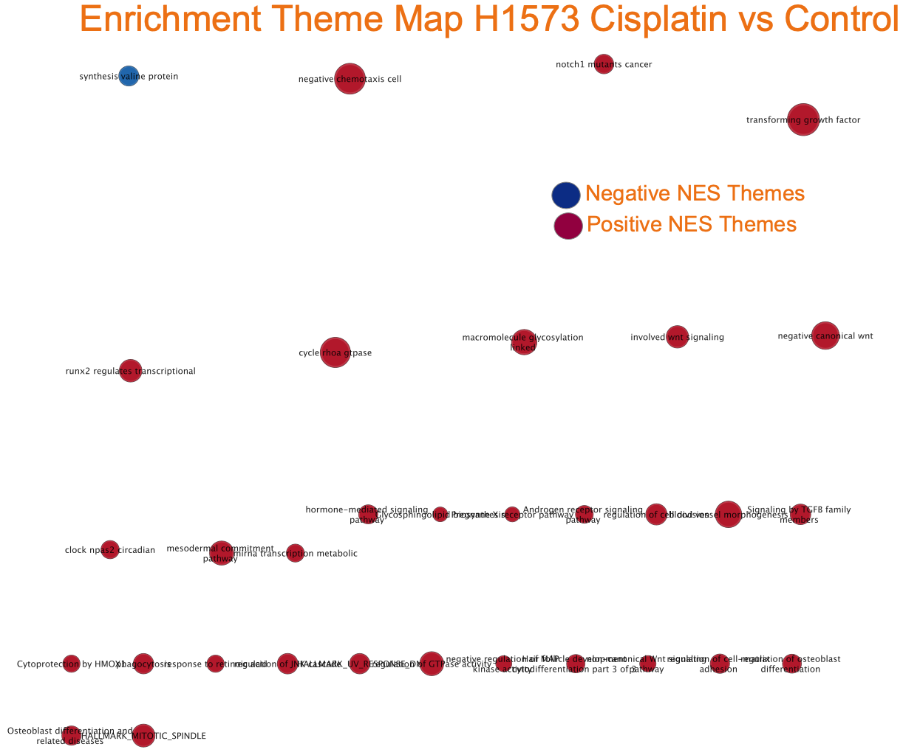

**Figure 15.** Collapsed Themes Enrichment Map for H1573 Cell Line. This figure distills the results of a comprehensive gene set enrichment analysis into a simplified map, emphasizing the dominant biological themes associated with the response to Cisplatin. The nodes, varying in size and color, represent clusters of gene sets, with red for themes that show a Positive Normalized Enrichment Score (Positive NES Themes) and blue for those with a Negative Normalized Enrichment Score (Negative NES Themes). Each node label encapsulates a broader biological theme, such as "negative chemotaxis cell" or "involved wnt signaling," summarizing the underlying pathways represented within the cluster. The layout reflects the relational structure and relative significance of these themes, offering an at-a-glance understanding of the key functional domains influenced by the treatment. This map is instrumental in pinpointing the most critical cellular processes impacted by Cisplatin and elucidates the potential mechanistic pathways through which the drug exerts its effects.

From our collapsed theme network seen in **Figure 15.**, we can see that we have some very prominent themes with many involved gene sets. For the negative gene sets we have only 1 theme called `synthesis valine protein` which is the exact thing as we saw in our annotated enrichment map. For the positive gene sets we had a few prominent themes, with the most prominent four being, `negative chemotaxis cell`, `transforming growth factor`, `cycle roha gtpase` and `negative canonical wnt`. From the outputs for our themes we can clearly see that they they fit our annotated model very well, where almost all the themes present are the exact name of the clusters we had in our annotated enrichment map. From our analysis we can see that most of the theme that are most enriched relate to cancer growth and development, which is what the focus of this study is.


# 6. Result interpretation and Post-analysis

In this section we will be evaluating our results and analyzing them further. The point of this is for us to relate our results not only to the output of the Thresholded Over Representation Analysis that we did in assignment 2, but to also see if our results concur with the findings of the original publication. This will allow us to see if our initial study questions were meaningfully addressed and if so how and if not why.

## A. Gene Set Expression Analyis Comparison to Orignal Paper, A2 Comparison and Evidence of Result Significance

In the original paper, the study reported transcriptional signature of early cisplatin drug-tolerant persister cells (DTPs) in lung adenocarcinoma.

From our gene set expression analysis, it's clear that a vast array of protein synthesis pathways---specifically those for various amino acids were among the most negatively impacted. This suggests a general downregulation of protein synthesis mechanisms, possibly reflecting a response to cisplatin-induced stress, where the cell aims to conserve resources by limiting anabolic processes, which also could be evidence of another mechanisim of the effectiveness of Cisplatin, as increased amino acid metablosim is a large contributer to cance growth (@AminoAcidDeath). In contrast, the positive enrichment of pathways like "RUNX2 REGULATES BONE DEVELOPMENT" (@Runx2) and "NOTCH SIGNALING" (@notch) in our analysis indicates a level of cellular adaptation towards survival pathways, which might be a characteristic of DTP cells as they strive to circumvent the cytotoxic effects of the drug. These results can be seen as very clear evidence of the effect of Cisplatin on cell survivial, however, the evidence of cellular adaptation towards survival pathways could be an indication of potential attempts at resistance to Cisplatin seen in the cells. Furthermore, one the most highly negatively regulated gene sets, was the "SARCOMERE ORGANIZATION" pathway, which is inline with the expected behaviour of succesful chemotheraputic drugs(@chemotheraputic). Moreover, we saw novel pathways such as the "SENSORY PERCEPTION OF TASTE" pathway, which was not discussed in the original paper, however, we found it to be significantly negatively regulated. This was very in line with previous findings, where chemotherapeutic drugs have been found to have a significant effect on taste, with the number of patients reporting such a change reaching as high as 84% (@taste) .

The enrichment of NOTCH signaling and pathways related to the cell cycle in our positively regulated gene sets echoes the original paper's observations of DTP cells deregulating metabolic and proliferative pathways. The presence of "RUNX2 REGULATES OSTEOBLAST DIFFERENTIATION" also suggests a role in cell differentiation that may be relevant to DTP cell survival or the acquisition of a more resistant phenotype. Moreover, the "HALLMARK_UV_RESPONSE_DN" among negatively regulated sets could indicate a transcriptional response to DNA damage (@Hallmark), consistent with cisplatin's mode of action (@CisplatinAction).

However, in comparison to our results of the Thresholded Over-Representation Analysis (ORA) that we did in `A2`, we see that there is not much evidence overlap, between them.

In ORA, the downregulated pathways appear to be highly specific to cellular processes like histone modification (HDACs deacetylate histones, HMTs methylate histone arginines), DNA methylation, and the components of the cell cycle (assembly of the ORC complex at the origin of replication). These results suggest a general downregulation of gene expression regulatory mechanisms and cellular replication processes.

The GSEA downregulated results show broader categories such as "PROTEIN SYNTHESIS", "SARCOMERE ORGANIZATION", and various sensory perception pathways. It also includes more specific pathways like "ACTIVATED PKN1 STIMULATES TRANSCRIPTION OF AR (ANDROGEN RECEPTOR) REGULATED GENES". This implies a broader scope of affected processes, including sensory perception and muscle organization, along with a decrease in protein synthesis.

The ORA upregulated pathways identify specific cycles like RAC1, RHOB, and CDC42 GTPase cycles, which are involved in cellular signaling and structure (@gtpases). There are also differentiation processes like endoderm differentiation and signaling pathways such as the response to transforming growth factor beta.

GSEA upregulated results include "NOTCH SIGNALING PATHWAY", "WNT SIGNALING", "REGULATION OF GTPASE ACTIVITY", which overlap with the ORA results in terms of signaling but also show pathways related to cancer ("SIGNALLING BY NOTCH1 HD+PEST DOMAIN MUTANTS IN CANCER"), which were not evident in the ORA results.

Overall, we saw that there were quite a few similarities between our findings from the gene set expression analysis and that of the original paper. Furthermore, we observed that many of the findings and implications relating to the pathways that were most regulated have been discussed in previous literature, which serves as evidence to support our findings.

## B. Dark Matter Analysis

Dark matter analysis is the process of investigating genes that might have a significant role to play in the processes that we are interested in, however they were not present in the output of our enrichment. This could be for three reasons, the first is that altight these genes are annotated they are annotated to gene sets that are filtered out when we conducted GSEA. As you can recall we removed gene sets that were either too small or too large. The second reason could be that they do not have annotations and the last reason could be that they do have annotations however, they are not part of our gene sets due to other reasons for exclusion, and the example being ones that inferred from electronic annotation, which is an exclusion that we have on our gene sets.

The reason I chose to go with the Dark Matter analysis related to the `SOCS1` gene. The `SOCS1` gene, the suppressor of cytokine signalling 1 gene, and it was found to be of very high correlation between the differential expression of the gene and the differential sensitivity to CDDP, where low expression of the gene would be an indicator of Cisplatin effectiveness.

However, after conducting GSEA, I was shocked to see that `SOCS1` was not found in any of the top 20 most enriched pathways neither the positively or the negatively enriched. Therefore, I wanted to utilize the dark matter analysis to not only investigate the issue with `SOCS1` representation but also the representation of other significant genes.

### i. Define Gene Sets from GSEA

First we will define the gene sets that we used in our GSEA analysis.

```{r, warning=FALSE, message=FALSE}
# Import the gene set analysis package
library(GSA)

# Set the gene set file that we used
gmt_file <- file.path(getwd(),"processed_data", "Human_GOBP_AllPathways_noPFOCR_no_GO_iea_April_01_2024_symbol.gmt")

# Capture the output of the GSA package reading the gene sets, as it is noisy
capture.output(genesets<-GSA.read.gmt(gmt_file),file="gsa_load.out")

# Get the names of all the genes in the gene sets
names(genesets$genesets) <- genesets$geneset.names
```


### ii. Define Expression File and Rank File

Here we will define the expressions file, of all the expressed genes and the ranks file containing the ranked genes.

```{r, warning=FALSE, message=FALSE}

# The file of expression files that we had restricted in A2
expression <- read.table(file.path(getwd(),"data", "H1573_norm_counts.txt"), header = TRUE, sep = ",", quote="\"", stringsAsFactors = FALSE)

# The file of the ranked genes that we had created earlier
ranks <- read.table(file.path(getwd(),"data", "H1573_Cisplatin_vs_Control_RNASeq_ranks.rnk"), header = TRUE, sep = "\t", quote="\"", stringsAsFactors = FALSE)

```


### iii. Define the GSEA result files

Here we will define what the GSEA results files are. These are two files one of the significantly negatively enriched gene sets and the other is of the significantly positively enriched gene sets.

```{r, warning=FALSE, message=FALSE}

#get all the GSEA directories
gsea_directories <- list.files(path = file.path(getwd(),"processed_data"), pattern = "\\.GseaPreranked")


if(length(gsea_directories) == 1){
  # Get the directory of the GSEA output directory
  gsea_dir <- file.path(getwd(),"processed_data",gsea_directories[1])

  # We get the output files for GSEA, boththe positive and the negative
  gsea_output_files <- list.files(path = gsea_dir, pattern = "^gsea_report.*\\.tsv$")
  
  # Get the list of significantly negatively enriched gene sets
  enr_file1 <- read.table(file.path(gsea_dir,gsea_output_files[1]), header = TRUE, sep = "\t", quote="\"", stringsAsFactors = FALSE,row.names=1)
  
  # Get the list of significantly positvely enriched gene sets
  enr_file2 <- read.table(file.path(gsea_dir,gsea_output_files[2]), header = TRUE, sep = "\t", quote="\"", stringsAsFactors = FALSE,row.names=1)
}


```

### iv. Get Enriched Genes and Caluclate Dark Matter

```{r}

# Get the names of all the enriched gene sets
all_enr_genesets<- c(rownames(enr_file1), rownames(enr_file2))

genes_enr_gs <- c()

# Iterate through the enriched gene sets both negative and positive and obtain all the genes in the 
for(i in 1:length(all_enr_genesets)){ 
  current_geneset <- unlist(genesets$genesets[which(genesets$geneset.names %in% all_enr_genesets[i])]) 
  genes_enr_gs <- union(genes_enr_gs, current_geneset) 
}

# Set the threshold for the significantly enriched genesets. We chose 0.005, as it is consistent with the threshold we have been using thus far in our study
FDR_threshold <- 0.005

# Get the gene sets that pass our threshold for both the negative and positive enriched gene sets
all_sig_enr_genesets<- c(rownames(enr_file1)[which(enr_file1[,"FDR.q.val"]<=FDR_threshold)], rownames(enr_file2)[which(enr_file2[,"FDR.q.val"]<=FDR_threshold)])

genes_sig_enr_gs <- c()

# Get all the genes that are in significantly enriched gene sets
for(i in 1:length(all_sig_enr_genesets)){
  current_geneset <- unlist(genesets$genesets[which(genesets$geneset.names %in% all_sig_enr_genesets[i])])
  genes_sig_enr_gs <- union(genes_sig_enr_gs, current_geneset)

}

genes_all_gs <- unique(unlist(genesets$genesets))

```

### v. Visualizing and presenting Dark Matter Overlaps

To visualize the overlap of the different divisions within the Dark Matter, we will be using a Venn Diagram

```{r, warning=FALSE, message=FALSE}
# 
# Check if the VennDiagram package is installed
if (!require(VennDiagram, quietly = TRUE)) {
  # If not installed, install the package
  install.packages("VennDiagram")
}

# Check if the grid package is installed
if (!require(grid, quietly = TRUE)) {
  # If not installed, install the package
  install.packages("VennDiagram")
}

grid.newpage()
# 
A <- genes_all_gs
B <- genes_enr_gs
C <- expression[,1]

# The venn diagram. We capture the output
grid.draw(draw.triple.venn( area1=length(A), area2=length(B), area3 = length(C), n12 = length(intersect(A,B)), n13=length(intersect(A,C)), n23 = length(intersect(B,C)), n123 = length(intersect(A,intersect(B,C))), category = c("all genesets","all enrichment results","expression"), fill = c("red","green","blue"), cat.col = c("red","green","blue") ))


```

**Figure 16.** Venn Diagram Illustrating the Intersection of All Differentially Expressed Genomic Regions, All gene in the Gene Sets, and Significantly Enriched Genes in the Gene Sets . The diagram presents three intersecting groups of genes: 'expression' (blue), 'all gene sets' (red), and 'significantly enriched gene sets' (green). The 'expression' set comprises 5854 genes differentially expressed but not annotated in any of the gene sets, and 1102 expressed genes that also appear in 'all genesets' but are not part of the 'significantly enriched gene sets'. The 'all genesets' set includes 1194 unique genes not identified in the differential expression analysis or the significantly enriched gene sets. The 'significantly enriched gene sets' exclusively contains 4205 genes not detected in the differential expression. At the heart of the diagram, 12096 differentially genes are shared across all three sets, indicating elements that are concurrently differentially expressed and part of the significantly enriched gene sets. 


Next we look explicitly at the genes that have no annotation and then in greater detail into the ones of high rank


```{r, warning=FALSE, message=FALSE}
# The set of genes that have no annotation
genes_no_annotation <- setdiff(expression[,1], genes_all_gs)

# The set of top ranked genes that have no annotations
ranked_gene_no_annotation <- ranks[which(ranks[,1] %in% genes_no_annotation),]

# Top 10 ranked genes with no annotations
ranked_gene_no_annotation[1:10,]

```

**Figure 17.** The above figure is of the top 10 most ranked genes with not annotations. The row names is the rank of the genes in comparison to the full differentially expressed gene list, and the columns are the gene names and their tank value. We see that we have the genes as high as number 9, not being annotated. 

### vi. Heat Map of Non-Annotated genes

In this section we will be looking at the heatmaps of two collections of genes which are of interest to the dark matter analysis. These are the set of significant genes that are not annotated to any of the pathways returned in the enrichment analysis and the set of significant genes that are not annotated to any pathways in entire set of pathways used for the analysis.

Firstly we create a function to scale the normalized counts

```{r, warning=FALSE, message=FALSE}
# Custom scale function that handles rows with zero variance and maintains data structure
scale_no_nan <- function(x) {
  # Initialize an empty matrix to store the scaled data
  scaled_matrix <- matrix(nrow = nrow(x), ncol = ncol(x), dimnames = dimnames(x))
  
  # Loop through each row
  for (i in 1:nrow(x)) {
    # Extract the row
    row <- x[i, ]
    # Scale the row if standard deviation is not zero
    if (sd(row) != 0) {
      scaled_matrix[i, ] <- (row - mean(row)) / sd(row)
    } else {
      # If the standard deviation is zero, fill with 0 
      scaled_matrix[i, ] <- rep(0, length(row))
    }
  }
  return(scaled_matrix)
}
```


```{r}
library(ComplexHeatmap)
library(circlize)

# We get the genes names for all the genes with significant differential expression but are not annotated to any of the pathways returned in the enrichment analysis
genes_no_annotation_in_enriched_pathways <- setdiff(intersect(expression[,1], genes_all_gs), genes_enr_gs)

# We then obtain the gene list from the normalized counts 
normalized_no_annotation_in_enriched_pathways_genes <- which(rownames(H1573_norm_counts) %in% genes_no_annotation_in_enriched_pathways) 

#Then we get the heatmap matrix for H1573, using only the significant genes that are not annotated to any of the pathways returned in the enrichment analysis
heatmap_matrix_H1573_no_annotation_in_enriched_pathways <- as.matrix(H1573_norm_counts[normalized_no_annotation_in_enriched_pathways_genes,])

# Apply the custom scaling function to your data
heatmap_matrix_H1573_no_annotation_in_enriched_pathways_scaled <- scale_no_nan(heatmap_matrix_H1573_no_annotation_in_enriched_pathways)


# Then we create the color scale. In our code we take into account whether our values start from 0, or if there are negative values as well
if(min(heatmap_matrix_H1573_no_annotation_in_enriched_pathways_scaled)  == 0){
  heat_mat_col <- circlize::colorRamp2(c(min(heatmap_matrix_H1573_no_annotation_in_enriched_pathways_scaled), 
                           max(heatmap_matrix_H1573_no_annotation_in_enriched_pathways_scaled)), 
                           c("white", "red"))
} else {
  heat_mat_col <- circlize::colorRamp2(c(min(heatmap_matrix_H1573_no_annotation_in_enriched_pathways_scaled), 
                           0, max(heatmap_matrix_H1573_no_annotation_in_enriched_pathways_scaled)),
                           c("blue", "white", "red"))
  
}

# We define the colors for the the treatment types for the annotations of our heatmap
treatment_types <- unique(sample_metadata_H1357$treatment)
treatment_types_color_scales <- rainbow(2)
names(treatment_types_color_scales) <- treatment_types

ha_pat <- ComplexHeatmap::HeatmapAnnotation(df=data.frame(
  treatment=sample_metadata_H1357$treatment))

heatmap_H1573_no_annotation_in_enriched_pathways_final <- ComplexHeatmap::Heatmap(heatmap_matrix_H1573_no_annotation_in_enriched_pathways_scaled, 
                                               top_annotation = ha_pat,
                                               cluster_rows = TRUE,cluster_columns = TRUE,
                                               show_row_names = FALSE, show_column_names = FALSE,
                                               show_row_dend = TRUE, show_column_dend = TRUE, 
                                               col=heat_mat_col, show_heatmap_legend = TRUE, 
                                               column_title = "H1573 Cisplatin vs Control Not Annotated in Enriched Pathways")

print(heatmap_H1573_no_annotation_in_enriched_pathways_final)
```

**Figure 18.** Heatmap of Significantly Expressed Genes Unannotated to Pathways in H1573 Cell Line. This heatmap illustrates the expression patterns of genes significantly affected by Cisplatin treatment in the H1573 cell line but not annotated in the pathways under study. Each row represents a gene, and each column corresponds to a sample, with the dendrogram on the left denoting hierarchical clustering of genes based on expression profiles. Red indicates higher expression levels, and blue indicates lower expression levels, with the intensity reflecting the degree of deviation from the mean. The top annotation bar shows the treatment applied to each sample, distinguishing between Cisplatin and Control. This visual analysis aids in identifying gene expression alterations due to Cisplatin treatment and pinpoints potential novel actors or targets not previously associated with known pathways.

Now we will visualize the heat map for the set of significant genes that are not annotated to any pathways in entire set of pathways used for the analysis.
```{r}
library(ComplexHeatmap)
library(circlize)

# We then obtain the gene list from the normalized counts 
normalized_no_annotation_genes <- which(rownames(H1573_norm_counts) %in% genes_no_annotation) 

#Then we get the heatmap matrix for H1573, using only the significant genes that are not annotated to any pathways in entire set of pathways used for the analysis
heatmap_matrix_H1573_no_annotation <- as.matrix(H1573_norm_counts[normalized_no_annotation_genes,])

# Apply the custom scaling function to your data
heatmap_matrix_H1573_no_annotation_scaled <- scale_no_nan(heatmap_matrix_H1573_no_annotation)


# Then we create the color scale. In our code we take into account whether our values start from 0, or if there are negative values as well
if(min(heatmap_matrix_H1573_no_annotation_scaled)  == 0){
  heat_mat_col <- circlize::colorRamp2(c(min(heatmap_matrix_H1573_no_annotation_scaled), 
                           max(heatmap_matrix_H1573_no_annotation_scaled)), 
                           c("white", "red"))
} else {
  heat_mat_col <- circlize::colorRamp2(c(min(heatmap_matrix_H1573_no_annotation_scaled), 
                           0, max(heatmap_matrix_H1573_no_annotation_scaled)),
                           c("blue", "white", "red"))
  
}

# We define the colors for the the treatment types for the annotations of our heatmap
treatment_types <- unique(sample_metadata_H1357$treatment)
treatment_types_color_scales <- rainbow(2)
names(treatment_types_color_scales) <- treatment_types

ha_pat <- ComplexHeatmap::HeatmapAnnotation(df=data.frame(
  treatment=sample_metadata_H1357$treatment))

heatmap_H1573_no_annotation_final <- ComplexHeatmap::Heatmap(heatmap_matrix_H1573_no_annotation_scaled, 
                                               top_annotation = ha_pat,
                                               cluster_rows = TRUE,cluster_columns = TRUE,
                                               show_row_names = FALSE, show_column_names = FALSE,
                                               show_row_dend = TRUE, show_column_dend = TRUE, 
                                               col=heat_mat_col, show_heatmap_legend = TRUE, 
                                               column_title = "H1573 Cisplatin vs Control Not Annotated in All Pathways")

print(heatmap_H1573_no_annotation_final)
```

**Figure 19.** Heatmap Analysis of H1573 Cell Line Expressing Genes Unassociated with Known Pathways. This heatmap provides a visual comparison of gene expression levels for genes that are significantly expressed following Cisplatin treatment but are not cataloged in any of the explored pathways. Rows represent individual genes, and columns represent samples, grouped by treatment type as indicated by the color bar above. Gene expression is normalized and represented by color intensity, with red for higher expression and blue for lower expression levels. Clustering on the left reflects similarities in expression patterns, grouping genes with like behaviors. This visualization enables the identification of genes that may play an uncharacterized role in the cell's response to Cisplatin, potentially uncovering novel insights into the drug's mechanism of action and cellular impact beyond established pathways.


# 7. References


